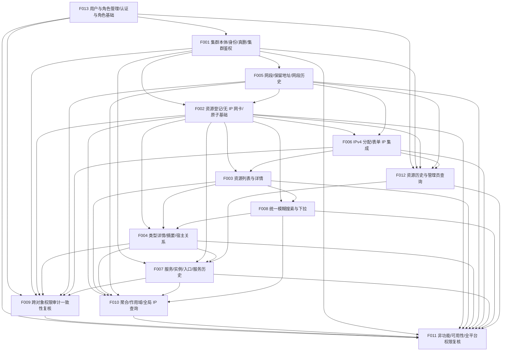

# CSM V2 依赖图（派生视图）

> 本文件由 `docs/project/project-plan.yaml` 派生，只引用计划事实。若与计划冲突，以计划为准。
> 计划状态：**ACCEPTED — 用户已批准 revision 9（2026-09-25）**；产品需求整体仍为 DRAFT，实施门禁独立适用。所有 Feature 均为 P0。
> 本次核对（revision 9）依据 BQ-W 关闭 D-NAME-COMPARISON 与 D-RESOURCE-HISTORY，并从所有 Feature 的 blocking_decisions 移除；
> 依赖边未变（F013 仍为唯一根），仅状态重算：F013 → READY，其余 12 个 Feature 仍 BLOCKED。

## 依赖边（depends_on）

| Feature | 依赖 | 说明 |
| --- | --- | --- |
| F013 用户与角色管理 | — | 根节点（唯一根）；交付平台自建用户/角色管理与登录会话基础，作为全部受管对象鉴权/审计的身份前提。 |
| F001 集群登记、身份、真实删除保护与集群本体权限审计 | F013 | 复用 F013 的角色/操作者解析与会话基础；交付集群归属与最小服务端鉴权/审计/历史。 |
| F002 计算资源登记、无 IP 网卡与一次原子提交基础 | F001、F005 | 需要集群归属；无 IP 网卡需选择本集群仍存网段（§4.6.9/4.6.10）；经 F001 传递获得 F013 基础。 |
| F003 计算资源统一列表、详情与服务端分页 | F002、F006 | 读取已登记资源；展示管理 IP 并在当前集群作用域内按 IP 搜索（§6.2）；详情“服务”列由 F007 扩展。 |
| F004 类型详情、列表/详情类型摘要与宿主关系 | F002、F003、F008 | 在 F002 表单与 F003 列表/详情上扩展类型详情；宿主搜索用 F008；闭环场景 2 的 VM 同名。 |
| F005 网段、保留地址与网段历史写入 | F001 | 网段属集群，独立于资源与 IP；经 F001 传递获得 F013 基础。 |
| F006 IPv4 分配与同一表单 IP 集成 | F002、F005 | 需要网卡/资源表单与网段；在其上集成 IP、管理 IP 与含 IP 原子提交；经 F001 传递获得 F013 基础。 |
| F007 服务、部署实例、访问入口与服务历史 | F001、F002、F004、F012 | 服务关联集群，实例指向资源（含 VM/F004）；服务/入口历史扩展 F012 统一查询；经 F001 传递获得 F013 基础。 |
| F008 统一模糊搜索与下拉交互 | F002、F003 | 基础搜索/下拉覆盖已交付对象（含资源页搜索）；宿主/服务/全局 IP 查询由 F004/F007/F010 适配。 |
| F009 跨对象权限审计一致性复核与集群切换验收 | F013、F001、F002、F004、F005、F006、F007 | 跨对象一致性复核需 F013 权限/会话基础与全部对象 Feature 的当期鉴权/审计已交付；方向为对象 → F009。 |
| F010 集群聚合概览、查询作用域与全局 IP 查询 | F002、F003、F004、F005、F007、F008 | 聚合计数依赖各资源；全局 IP 查询复用搜索交互；VM 计数来源 F004。 |
| F011 非功能、可用性基线与全平台权限复核 | F013、F001、F002、F003、F004、F005、F006、F007、F008、F009、F010、F012 | 端到端复核分页/原子/并发/竞态，并复核全平台鉴权（含 F013 用户/角色/登录）与全部搜索面（37/38/57）。 |
| F012 资源历史保留与管理员查询 | F013、F001、F002、F005、F006 | 资源历史查询依赖集群/计算资源/网段/IP 已交付，并复用 F013 交付、经 F001 集成的统一角色/操作者解析基础。 |

依赖关系为无环有向图（DAG），拓扑序（一个合法解）：`F013 → F001 → F005 → F002 → F006 → F012 → F003 → F008 → F004 → F007 → F009 → F010 → F011`。需求覆盖为 requirements-v2.md §10 全部 81 条验收场景，每条场景的 `closure_owner` 见计划 `requirement_coverage.scenarios`。

## Feature 级验收顺序（消除死锁）

- 新增 F013 depends_on []（唯一根，交付平台自建用户/角色与会话基础）。
- F001 depends_on 由 [] 调整为 [F013]（集群本体最小服务端鉴权复用 F013 的身份/角色/会话基础）。
- F009 depends_on 增 F013（跨对象权限/审计一致性复核直接复核 F013 的权限/会话基础，场景 40）。
- F011 depends_on 增 F013（全平台三角色终局复核含用户/角色/登录，场景 57）。
- F012 depends_on 增 F013（管理员可查历史复用 F013 的角色/操作者判定，场景 48/61/64）。
- F002/F005/F006/F007 经 F001 传递获得 F013 基础，未新增冗余直边（避免假依赖）。

## Mermaid 图

## 关键路径

`F013 → F001 → F005 → F002 → F006 → F003 → F008 → F004 → F007 → F009 → F011` 为最长实施链，是决定 P0 完成时间的关键路径。`F012` 在其依赖对象交付后、F009 之前提供管理员历史查询；`F009` 位于全部对象 Feature 之后做一致性复核；`F013` 为唯一根。

## 全局架构前提

架构决策 D-ARCH-STACK、D-ARCH-DB、D-ARCH-API、D-ARCH-DEPLOY 以及 D-BQ-F 已由用户批准/随 BQ-V 关闭（RESOLVED），但架构文档、API 契约与数据库设计尚未产出，仍构成项目级阶段门禁（不表现为 Feature 依赖）。

因此当前 F013 为 READY（depends_on=[] 且 blocking_decisions=[]），其余 12 个 Feature 仍为 BLOCKED。