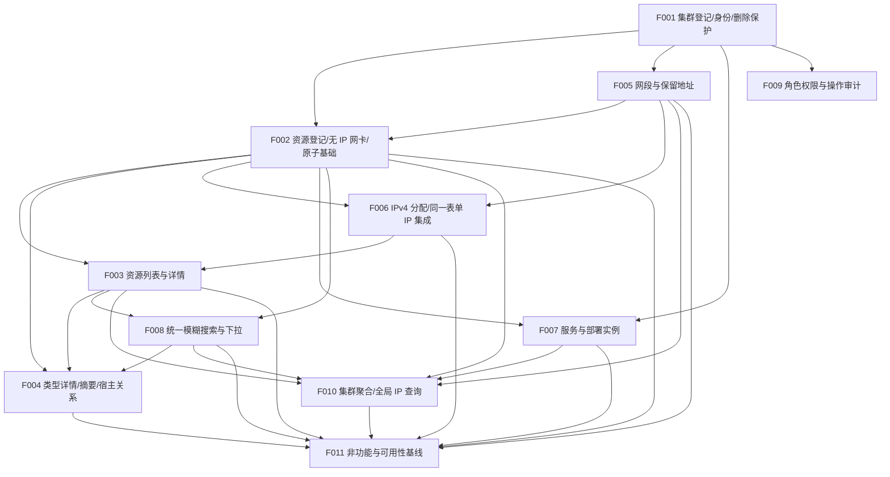

# CSM V2 依赖图（派生视图）

> 本文件由 `docs/project/project-plan.yaml` 派生，只引用计划事实。若与计划冲突，以计划为准。
> 计划状态：**ACCEPTED — 用户已批准 revision 6（2026-09-24）**；产品需求整体仍为 DRAFT，实施门禁独立适用。所有 Feature 均为 P0。
> 本次核对（revision 6）按“Feature DONE 必须具有当时可独立验收价值”调整依赖：
> 新增 `F003 → F008`、`F004/F005/F007/F010 → F011`，并调整 F008/F011 的 `depends_on`；
> revision 5 的 `F005 → F002`、`F006 → F003`、`F003 → F004` 保持。

## 依赖边（depends_on）

| Feature | 依赖 | 说明 |
| --- | --- | --- |
| F001 集群登记、身份与删除保护 | — | 根节点，所有资源归属前提；只定义删除保护规则与无关联场景 |
| F002 计算资源登记、无 IP 网卡与一次原子提交基础 | F001, F005 | 需要集群归属；无 IP 网卡需选择本集群有效网段（§4.6.9/4.6.10） |
| F003 计算资源列表与详情 | F002, F006 | 读取已登记资源；展示管理 IP 并在当前集群作用域内按 IP 搜索（§6.2）；详情“服务”列由 F007 扩展 |
| F004 类型详情、列表/详情类型摘要与宿主关系 | F002, F003, F008 | 在 F002 表单与 F003 列表/详情上扩展类型详情；宿主搜索用 F008；闭环场景 2 的 VM 同名 |
| F005 网段与保留地址管理 | F001 | 网段属集群，独立于资源与 IP |
| F006 IPv4 分配与同一表单 IP 集成 | F002, F005 | 需要有网卡/资源表单与网段；在其上集成 IP、管理 IP 与含 IP 原子提交 |
| F007 服务、部署实例与访问入口 | F001, F002 | 服务关联集群，实例指向资源；服务/服务实例搜索按 §8 适配 |
| F008 统一模糊搜索与下拉交互 | F002, F003 | 基础搜索/下拉覆盖已交付对象（含资源页搜索）；宿主/服务/全局 IP 查询由 F004/F007/F010 适配 |
| F009 角色权限与操作审计 | F001 | 权限与审计作用于平台资源 |
| F010 集群聚合、查询作用域与全局 IP 查询 | F002, F003, F005, F007, F008 | 聚合计数依赖各资源；全局 IP 查询复用搜索交互 |
| F011 非功能与可用性基线 | F002, F003, F004, F005, F006, F007, F008, F010 | 端到端复核分页/原子/并发/竞态，并闭环全部搜索面（37/38）全量覆盖 |

依赖关系为无环有向图（DAG）。需求覆盖为 requirements-v2.md §10 全部 57 条验收场景（含 BQ-H 新增/修订 45–57），每条场景的 `closure_owner` 见计划 `requirement_coverage.scenarios`。

## Feature 级验收顺序（消除死锁）

- `F002 → F006`：F002 先交付公共信息、类型字段容器（不含 VM 必填宿主）与无 IP 网卡 + 整单原子基础；F006 再于同一表单集成 IP、管理 IP 与含 IP 整单原子。因此 **F002 DONE 时只验收公共信息、类型字段容器与无 IP 网卡**，`M1` 退出（F006 DONE）时交付完整一次录入 IP。这是交付分段，不是产品限制。
- `F005 → F002`：F005（网段）先于 F002（网卡选网段），避免 F005 的“网段被引用保护”反向依赖资源。
- `F006 → F003`：F003 展示管理 IP 并支持按 IP 搜索，故须在 F006 之后验收。
- `F003 → F004`：F004 在 F003 的列表/详情之上扩展类型摘要与类型专有详情。
- `F003 → F008`：F008 的基础搜索需覆盖资源页搜索面（M1 的 F003）。
- `F008/F004/F007/F010 → F011`：F011 作为最终集成，须在宿主（F004）、服务与服务实例（F007）、全局 IP 查询（F010）等全部搜索面交付后，才能闭环场景 37/38 的全量覆盖。
- 场景 51（集群删除保护）不建立 `F007 → F005` 伪依赖：F002（M1）/F005（M1）/F007（M3）分别验收各自关联，Milestone 顺序保证 F007 在 M3 完成最终闭环。

## 场景 closure_owner 与依赖

修正后各场景的 `closure_owner` 均位于其参与 Feature 的最晚依赖位置，不存在“闭环早于参与 Feature”的死锁：

- 场景 37/38 的最终 `closure_owner` 为 F011（M4），F008 只闭环已交付对象的基础部分。
- 场景 2 的 `closure_owner` 为 F004（M2，VM 注册含必填宿主），F002 只闭环同名裸金属/名称唯一。
- 场景 5/6/42 的 `closure_owner` 为 F007（M3），F002/F004/F006 分别闭环网卡/IP、类型详情、网络内容部分。
- 场景 45 的 `closure_owner` 为 F006，F002 只闭环同名确认与既有网卡加载。

## Mermaid 图

## 关键路径

`F001 → F005 → F002 → F006 → F003 → F004`（或经 F003 → F010）为最长实施链，是决定 P0 完成时间的关键路径。`F008`（搜索）被 `F004`、`F010`、`F011` 依赖；`F007`（服务）被 `F010`、`F011` 依赖；`F011`（M4）依赖最终对象与全部搜索面。

## 全局架构前提

所有 Feature 在实现前依赖以下未批准架构决策（不表现为 Feature 依赖，而是项目级门禁）：

- D-ARCH-STACK、D-ARCH-DB、D-ARCH-API、D-ARCH-DEPLOY。

因此当前无 READY Feature，全部为 BLOCKED。
