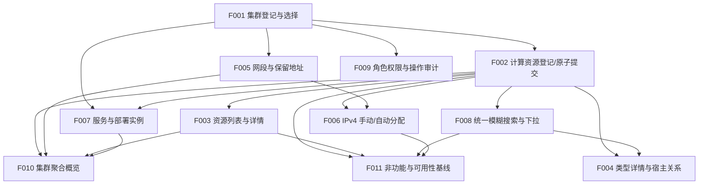

# CSM V2 依赖图（派生视图）

> 本文件由 `docs/project/project-plan.yaml` 派生，只引用计划事实。若与计划冲突，以计划为准。
> 计划状态：**DRAFT — 等待用户批准**。所有 Feature 均为 P0。

## 依赖边（depends_on）

| Feature | 依赖 | 说明 |
| --- | --- | --- |
| F001 集群登记与选择 | — | 根节点，所有资源归属前提 |
| F002 计算资源登记与一次原子提交 | F001 | 需要集群归属 |
| F003 计算资源列表与详情 | F002 | 列表/详情读取已登记资源 |
| F004 类型详情与宿主关系 | F002, F008 | 需要资源登记与宿主搜索下拉 |
| F005 网段与保留地址管理 | F001 | 网段属集群 |
| F006 IPv4 手动与自动分配 | F002, F005 | 需要网卡/资源与网段 |
| F007 服务与部署实例 | F001, F002 | 服务关联集群，实例指向资源 |
| F008 统一模糊搜索与下拉 | F002 | 搜索作用于资源等对象 |
| F009 角色权限与操作审计 | F001 | 权限与审计作用于平台资源 |
| F010 集群聚合概览与搜索作用域 | F002, F003, F005, F007 | 聚合计数依赖各资源 |
| F011 非功能与可用性基线 | F002, F003, F006, F008 | 验证分页/原子/并发/竞态 |

依赖关系为无环有向图（DAG）。

## Mermaid 图

## 关键路径

`F001 → F002 → F005 → F006 → F011` 为最长实施链（含依赖收敛），是决定 P0 完成时间的关键路径。`F008`（搜索）被 `F004` 与 `F011` 依赖；`F007`（服务）被 `F010` 依赖。

## 全局架构前提

所有 Feature 在实现前依赖以下未批准架构决策（不表现为 Feature 依赖，而是项目级门禁）：

- D-ARCH-STACK、D-ARCH-DB、D-ARCH-API、D-ARCH-DEPLOY。

因此当前无 READY Feature，全部为 BLOCKED。