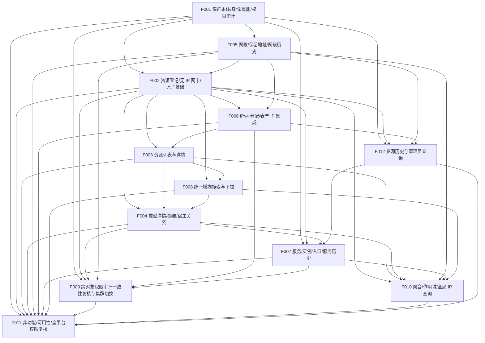

# CSM V2 依赖图（派生视图）

> 本文件由 `docs/project/project-plan.yaml` 派生，只引用计划事实。若与计划冲突，以计划为准。
> 计划状态：**ACCEPTED — 用户已批准 revision 7（2026-09-25）**；产品需求整体仍为 DRAFT，实施门禁独立适用。所有 Feature 均为 P0。
> 本次核对（revision 7）按“对象级鉴权/审计/历史写入随对象当期交付、F009 只做一致性复核”调整依赖：
> F007 dep 增 F004、F012；F009 dep 调整为全部对象 Feature；F010 dep 增 F004；F011 dep 增 F009、F012；新增 F012。

## 依赖边（depends_on）

| Feature | 依赖 | 说明 |
| --- | --- | --- |
| F001 集群登记、身份、真实删除保护与平台角色/集群本体权限审计 | — | 根节点，所有资源归属前提；交付平台角色/操作者解析基础与集群本体鉴权/审计/历史。 |
| F002 计算资源登记、无 IP 网卡与一次原子提交基础 | F001、F005 | 需要集群归属；无 IP 网卡需选择本集群仍存网段（§4.6.9/4.6.10）。 |
| F003 计算资源统一列表、详情与服务端分页 | F002、F006 | 读取已登记资源；展示管理 IP 并在当前集群作用域内按 IP 搜索（§6.2）；详情“服务”列由 F007 扩展。 |
| F004 类型详情、列表/详情类型摘要与宿主关系 | F002、F003、F008 | 在 F002 表单与 F003 列表/详情上扩展类型详情；宿主搜索用 F008；闭环场景 2 的 VM 同名。 |
| F005 网段、保留地址与网段历史写入 | F001 | 网段属集群，独立于资源与 IP。 |
| F006 IPv4 分配与同一表单 IP 集成 | F002、F005 | 需要网卡/资源表单与网段；在其上集成 IP、管理 IP 与含 IP 原子提交。 |
| F007 服务、部署实例、访问入口与服务历史 | F001、F002、F004、F012 | 服务关联集群，实例指向资源（含 VM/F004）；服务/入口历史扩展 F012 统一查询；服务/实例搜索按 §8 适配。 |
| F008 统一模糊搜索与下拉交互 | F002、F003 | 基础搜索/下拉覆盖已交付对象（含资源页搜索）；宿主/服务/全局 IP 查询由 F004/F007/F010 适配。 |
| F009 跨对象权限审计一致性复核与集群切换验收 | F001、F002、F004、F005、F006、F007 | 跨对象一致性复核需全部对象 Feature 的当期鉴权/审计已交付；方向为对象 → F009。 |
| F010 集群聚合概览、查询作用域与全局 IP 查询 | F002、F003、F004、F005、F007、F008 | 聚合计数依赖各资源；全局 IP 查询复用搜索交互；VM 计数来源 F004。 |
| F011 非功能、可用性基线与全平台权限复核 | F001、F002、F003、F004、F005、F006、F007、F008、F009、F010、F012 | 端到端复核分页/原子/并发/竞态，并复核全平台鉴权与全部搜索面（37/38/57）。 |
| F012 资源历史保留与管理员查询 | F001、F002、F005、F006 | 资源历史查询依赖集群/计算资源/网段/IP 已交付并复用 F001 角色基础。 |

依赖关系为无环有向图（DAG），拓扑序：`F001 → F005 → F002 → F006 → F012 → F003 → F008 → F004 → F007 → F009 → F010 → F011`。需求覆盖为 requirements-v2.md §10 全部 71 条验收场景，每条场景的 `closure_owner` 见计划 `requirement_coverage.scenarios`。

## Feature 级验收顺序（消除死锁）

- F007 depends_on 由 [F001, F002] 调整为 [F001, F002, F004, F012]（部署实例目标含 VM，服务/入口历史扩展 F012 统一查询）。
- F009 depends_on 由 [F001] 调整为 [F001, F002, F004, F005, F006, F007]（收敛为已交付对象的跨对象一致性复核，方向为对象 → F009）。
- F010 depends_on 增补 F004（类型摘要与 VM 计数来源）。
- F011 depends_on 由 [F002, F003, F004, F005, F006, F007, F008, F010] 调整为 [F001, F002, F003, F004, F005, F006, F007, F008, F009, F010, F012]（全平台终局复核需 F009 复核结论与 F012 历史查询）。
- 新增 F012 depends_on [F001, F002, F005, F006]。
- F002/F003/F004/F005/F006/F008 的依赖边未变（F002 维持 [F001, F005]，F005 维持 [F001]）。

## Mermaid 图

## 关键路径

`F001 → F005 → F002 → F006 → F003 → F008 → F004 → F007 → F010 → F011` 为最长实施链，是决定 P0 完成时间的关键路径。`F009` 位于全部对象 Feature 之后做一致性复核；`F012` 在 F007 之前提供已交付对象的历史查询。

## 全局架构前提

所有 Feature 在实现前依赖以下未批准架构决策（不表现为 Feature 依赖，而是项目级门禁）：

- D-ARCH-STACK、D-ARCH-DB、D-ARCH-API、D-ARCH-DEPLOY。

因此当前无 READY Feature，全部为 BLOCKED。
