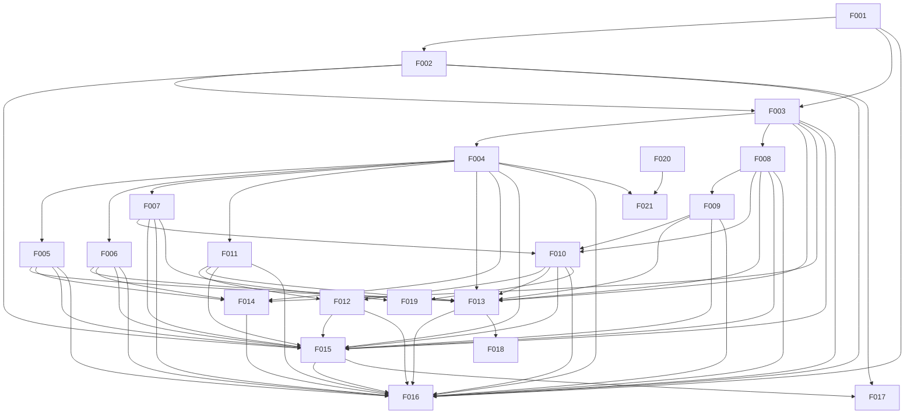

# Dependency Map

<!-- Generated by scripts/render_project_views.py; do not edit manually. -->

计划 revision：9；状态：DRAFT；完整性：complete。

箭头从前置 Feature 指向依赖它的 Feature。

```mermaid
flowchart TD
    n0["F001"]
    n1["F002"]
    n2["F003"]
    n3["F004"]
    n4["F005"]
    n5["F006"]
    n6["F007"]
    n7["F008"]
    n8["F009"]
    n9["F010"]
    n10["F011"]
    n11["F012"]
    n12["F013"]
    n13["F014"]
    n14["F015"]
    n15["F016"]
    n16["F017"]
    n17["F018"]
    n18["F019"]
    n19["F020"]
    n20["F021"]
    n0 --> n1
    n0 --> n2
    n1 --> n2
    n2 --> n3
    n3 --> n4
    n3 --> n5
    n3 --> n6
    n2 --> n7
    n7 --> n8
    n6 --> n9
    n7 --> n9
    n8 --> n9
    n3 --> n10
    n9 --> n11
    n10 --> n11
    n2 --> n12
    n3 --> n12
    n4 --> n12
    n5 --> n12
    n7 --> n12
    n8 --> n12
    n9 --> n12
    n10 --> n12
    n2 --> n13
    n3 --> n13
    n4 --> n13
    n5 --> n13
    n1 --> n14
    n2 --> n14
    n3 --> n14
    n4 --> n14
    n5 --> n14
    n6 --> n14
    n7 --> n14
    n8 --> n14
    n9 --> n14
    n10 --> n14
    n11 --> n14
    n0 --> n15
    n1 --> n15
    n2 --> n15
    n3 --> n15
    n4 --> n15
    n5 --> n15
    n6 --> n15
    n7 --> n15
    n8 --> n15
    n9 --> n15
    n10 --> n15
    n11 --> n15
    n12 --> n15
    n13 --> n15
    n14 --> n15
    n1 --> n16
    n14 --> n16
    n12 --> n17
    n6 --> n18
    n9 --> n18
    n3 --> n20
    n19 --> n20
```
