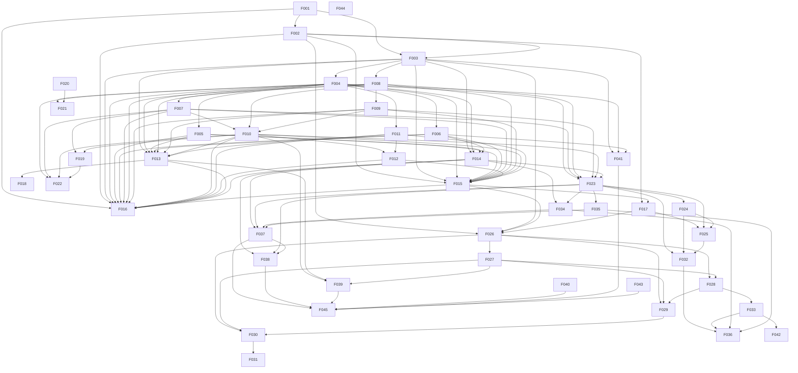

# Dependency Map

<!-- Generated by scripts/render_project_views.py; do not edit manually. -->

计划 revision：25；状态：IN_PROGRESS；完整性：complete。

箭头从前置 Feature 指向依赖它的 Feature。

```mermaid
flowchart TD
    n0["F001"]
    n1["F002"]
    n2["F003"]
    n3["F004"]
    n4["F005"]
    n5["F006"]
    n6["F007"]
    n7["F008"]
    n8["F009"]
    n9["F010"]
    n10["F011"]
    n11["F012"]
    n12["F013"]
    n13["F014"]
    n14["F015"]
    n15["F016"]
    n16["F017"]
    n17["F018"]
    n18["F019"]
    n19["F020"]
    n20["F021"]
    n21["F022"]
    n22["F023"]
    n23["F024"]
    n24["F025"]
    n25["F026"]
    n26["F027"]
    n27["F028"]
    n28["F029"]
    n29["F030"]
    n30["F031"]
    n31["F032"]
    n32["F033"]
    n33["F034"]
    n34["F035"]
    n35["F036"]
    n36["F037"]
    n37["F038"]
    n38["F039"]
    n39["F040"]
    n40["F041"]
    n41["F042"]
    n42["F043"]
    n43["F044"]
    n44["F045"]
    n0 --> n1
    n0 --> n2
    n1 --> n2
    n2 --> n3
    n3 --> n4
    n3 --> n5
    n3 --> n6
    n2 --> n7
    n7 --> n8
    n6 --> n9
    n7 --> n9
    n8 --> n9
    n3 --> n10
    n9 --> n11
    n10 --> n11
    n2 --> n12
    n3 --> n12
    n4 --> n12
    n5 --> n12
    n7 --> n12
    n8 --> n12
    n9 --> n12
    n10 --> n12
    n2 --> n13
    n3 --> n13
    n4 --> n13
    n5 --> n13
    n1 --> n14
    n2 --> n14
    n3 --> n14
    n4 --> n14
    n5 --> n14
    n6 --> n14
    n7 --> n14
    n8 --> n14
    n9 --> n14
    n10 --> n14
    n11 --> n14
    n0 --> n15
    n1 --> n15
    n2 --> n15
    n3 --> n15
    n4 --> n15
    n5 --> n15
    n6 --> n15
    n7 --> n15
    n8 --> n15
    n9 --> n15
    n10 --> n15
    n11 --> n15
    n12 --> n15
    n13 --> n15
    n14 --> n15
    n1 --> n16
    n14 --> n16
    n12 --> n17
    n6 --> n18
    n9 --> n18
    n3 --> n20
    n19 --> n20
    n3 --> n21
    n6 --> n21
    n9 --> n21
    n18 --> n21
    n3 --> n22
    n6 --> n22
    n7 --> n22
    n8 --> n22
    n9 --> n22
    n13 --> n22
    n22 --> n23
    n16 --> n24
    n22 --> n24
    n23 --> n24
    n1 --> n25
    n2 --> n25
    n14 --> n25
    n16 --> n25
    n25 --> n26
    n25 --> n27
    n26 --> n27
    n25 --> n28
    n26 --> n28
    n27 --> n28
    n25 --> n29
    n26 --> n29
    n28 --> n29
    n29 --> n30
    n22 --> n31
    n23 --> n31
    n24 --> n31
    n27 --> n32
    n13 --> n33
    n22 --> n33
    n22 --> n34
    n31 --> n35
    n32 --> n35
    n33 --> n35
    n34 --> n35
    n13 --> n36
    n22 --> n36
    n33 --> n36
    n34 --> n36
    n13 --> n37
    n22 --> n37
    n36 --> n37
    n9 --> n38
    n12 --> n38
    n26 --> n38
    n2 --> n40
    n3 --> n40
    n5 --> n40
    n32 --> n41
    n36 --> n44
    n37 --> n44
    n38 --> n44
    n39 --> n44
    n40 --> n44
    n42 --> n44
```
