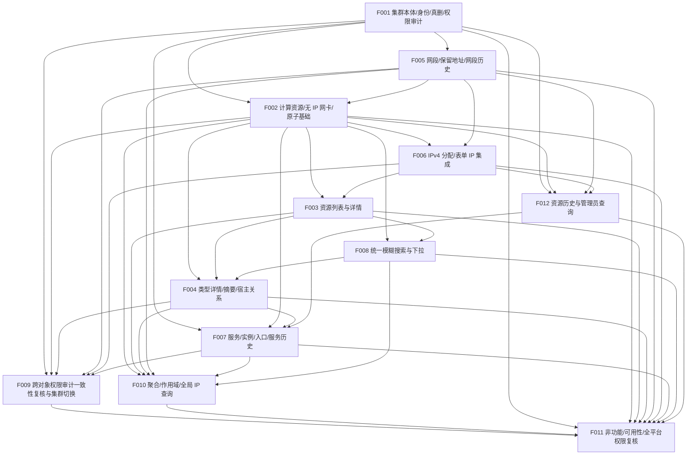

# CSM V2 计划 revision 7 候选（完整待审批提案）

> Status: **CANDIDATE revision 7 — READY FOR APPROVAL**（第二轮 RV7-01…RV7-07 与第三轮 RV7R3-01…RV7R3-09 已逐条处置，自检与拓扑核对已完成；候选完整，供用户批准；未自行批准、未落稿）
> Document Type: Project Plan Change Proposal
> Basis: `docs/product/requirements-v2.md`（BQ-M–BQ-U 已确认，§10 场景 **1–71**）与 `docs/product/domain-model.md`
> 本文件是**待用户批准的项目计划候选**，不是项目机器状态。唯一机器状态来源仍是 `docs/project/project-plan.yaml`（revision 6，`ACCEPTED`，2026-09-24，批准提交 `350870fcb6ddf79bd9a57f43c6b14fc2e5a903b0`）。
> 本提案**不修改** `project-plan.yaml`、`backlog.md`、`dependency-map.md`、`milestones.md`，不写入任何 `git`/`evidence`/Test/Review/DONE 证据，也不自行启动实施。revision 6 执行基线不被静默覆盖；revision 7 仅在用户单独批准后由协调器落稿。

---

## 0. 本轮结论摘要

- 产品范围已由 BQ-M–BQ-U 从“部分逻辑删除/恢复 + 集群真实删除”改为“**全部受管资源仅真实删除**”，并新增资源历史、服务零关联/最后关联解除、入口逐条真删、宿主/计算资源删除依赖、服务编号与集群 `code` 永不复用等规则；新增场景 **71**（集群本体 CRUD / 空关联删除 + 服务端授权 / 审计，从跨对象场景 50/58 拆出，可在 F001 当期独立验收）。revision 6 的软删/恢复前提已失效，`gaps: []` 与 57 条映射不能再代表新范围。
- 本候选在**保留全部稳定 Feature ID（F001–F011）**的基础上，保留 1 个 P0 Feature `F012 资源历史保留与管理员查询`（由 BQ-N/BQ-Q 的新增已确认要求产生），共 **12 个 Feature，全部 P0**；Feature 状态全部 `BLOCKED`（依赖未 DONE 且 §11.2 / D-ARCH-* 未裁定），与本候选“可供审批”是两回事。
- **权限/审计/历史写入随对象当期交付**：F001 交付平台角色/操作者解析基础并在集群本体完成最小服务端鉴权、审计与历史写入；F002/F005/F006/F007 各自在 DONE 时落实本对象的服务端三角色鉴权、操作审计与历史写入，**不等待 F009 后补**；F009 晚期只做已交付对象的权限/审计一致性复核与集群切换场景 40 闭环。
- 覆盖 `requirements-v2.md §10` 全部 **71 条**验收场景，逐条登记 `participants` / `closure_owner` / `parts`；`gaps` 为空（“完整性”指场景覆盖与映射，不指 §11.2 设计期 `OPEN` 已关闭）。
- 依赖为**无环有向图**；每个 Feature 在 `depends_on` 满足时都有**可独立验收的用户可见价值**；无 `closure_owner` 早于其参与 Feature；Milestone 退出标准只引用本 Milestone 或更早已闭环的场景；**没有任何 scope 早于其生产对象的创建，对象级鉴权/审计/历史写入也不再晚于对象落地**（随对象当期交付，历史查询按交付阶段排后）。
- §11.2 的设计期 `OPEN` 项**如实挂为 Feature 阻塞决策**，不代填业务规则。当前无 `READY` Feature，不进入实施。
- 项目状态：revision 6 仍为唯一已批准的 `ACCEPTED` 基线；本候选为待批准的候选（READY FOR APPROVAL），机器计划、派生视图与执行检查点均未改变。

### 0.1 复审修复对照

#### 第二轮复审 RV7-01…RV7-07 → 本轮修订

| 编号 | 级别 | Reviewer finding（第二轮） | 本轮修订 |
| --- | --- | --- | --- |
| RV7-01 | BLOCKER | F002/F005/F006/F007 先于 F009 DONE，但对象级服务端三角色鉴权与操作审计被安排由 F009“补齐”，对象 DONE 时缺权限/审计；F001 未交付平台角色/操作者解析基础，且 `D-BQ-F` 未挂 F001 | F001 交付**平台角色/操作者解析基础**并在集群本体完成最小服务端鉴权、审计与历史写入，`D-BQ-F` 挂 F001；F002/F005/F006/F007 **各自 DONE 时落实本对象**服务端三角色鉴权 + 操作审计 + 历史写入，不等 F009；F009 收敛为已交付对象的权限/审计一致性复核 + 场景 40 闭环（见 F001/F002/F005/F006/F007/F009） |
| RV7-02 | HIGH | F006 把场景 46 归自身闭环，但 46 含“遵守关联保护”（VM/服务实例等仍存关联），F006 DONE 时 F004/F007 尚未交付，无法验收 | 场景 46 的 `closure_owner` 改为 **F007**（参与 F002/F004/F006/F007）；F006 仅承担管理 IP 显式清空/重选与自身子项先删部分 |
| RV7-03 | MEDIUM | 场景 68 明确包含“VM/其网卡/IP/**部署关系**均不自动删除或改挂”，F004（M2）DONE 时服务部署实例（F007，M3）尚不存在 | 场景 68 的 `closure_owner` 改为 **F007**（参与 F002/F004/F007）；F004 只验收 VM 关系侧，部署关系侧由 F007 联验 |
| RV7-04 | MEDIUM | F012 与 F009 的职责边界、F007 的服务历史查询扩展在 participants/parts 中未对齐，`D-RESOURCE-HISTORY` 描述未反映“写入随对象、查询分阶段、F009 只复核” | F012 明确**在 F009 之前、复用 F001 统一角色基础、仅管理员**读本阶段已交付对象历史；F007 追加服务/入口历史写入并扩展统一查询、联验 63/67/69/70；`D-RESOURCE-HISTORY` 描述与受影响 Feature 同步 |
| RV7-05 | MEDIUM | 场景 46/68 归属变化后，participants/parts、Feature 闭环计数、M1–M4 出口、拓扑核验与变更审计未联动 | 逐项重算：闭环分布 F004 8、F006 20、F007 17，其余不变，合计仍 71；M1 34、M2 9、M3 21、M4 7；§5 拓扑与 §9 自检同步（见 §6/§7/§8/§9） |
| RV7-06 | LOW | F009 收敛后必须仍有独立用户可观察验收，且不得再承担对象基础鉴权实施 | F009 定位为**跨对象集成验收 Feature**，独立用户可观察验收为场景 40（集群切换不改变角色权限、权限由服务端执行）；`out_of_scope` 明确不含任何对象级鉴权/审计实现 |
| RV7-07 | LOW | 移出场景 68 后需确认 F004 在 M2 仍有可独立验收价值，且产品口径逐条对齐、无新增业务规则 | F004 保留 M2 内闭环 1/2/13/14/15/33/35/36（8 条），M2 非空；全文只重述已确认裁定，未新增业务规则，未违反“先删依赖” |

#### 第一轮复审 R7-B1…R7-M4 处置状态（保留）

| 编号 | 级别 | 结论 |
| --- | --- | --- |
| R7-B1 | BLOCKER | 已关闭；本轮进一步把对象级权限/审计下沉到各自 Feature，F009 不再实施基础鉴权 |
| R7-B2 | BLOCKER | 已关闭；场景 58 由 F007 闭环，F001 只承担集群名称字符/大小写规则 |
| R7-H1 | HIGH | 已关闭；F002 不承诺 VM/服务实例关联拒绝 |
| R7-H2 | HIGH | 已关闭；F012 不含服务历史，服务/入口历史与统一查询由 F007 扩展 |
| R7-H3 | HIGH | 已关闭；F005 明确网段历史写入并挂 D-RESOURCE-HISTORY |
| R7-M1 | MEDIUM | 已关闭；F012 依赖 F006，覆盖已交付 IP 历史查询 |
| R7-M2 | MEDIUM | 已关闭；服务/入口历史查询由 F007 验收 |
| R7-M3 | MEDIUM | 已关闭；participants 55/56/59/63 已补齐，本轮续补 40/46/57/68 |
| R7-M4 | MEDIUM | 已关闭；F009 维持 M3（与 rev6 一致、未前置）并收敛为跨对象集成验收，本轮进一步明确只做复核、不实施基础鉴权 |

#### 第三轮复审 RV7R3-01…RV7R3-09 → 本轮修订

| 编号 | 级别 | Reviewer finding（第三轮） | 本轮修订 |
| --- | --- | --- | --- |
| RV7R3-01 | HIGH | §3.2 的 `revision 6` 列混入前一版 rev7 候选数据（“对象 Feature 依赖 F009”“F007 dep 含 F004/F009/F012”“F012 含服务历史”“F005 仅定义网段删除规则”），未真实对照 `project-plan.yaml` rev6 | C3/C4/C5/C6 的 `revision 6` 列按 rev6 实际值改写：F009 dep `[F001]` 且**无任何 Feature 依赖 F009**；F007 dep `[F001,F002]`；rev6 **无 F012**；F005 含“状态（有效/已删除）/逻辑删除”且**无历史写入**；理由同步 |
| RV7R3-02 | HIGH | §11 落稿范围未要求重建 `requirement_coverage.rule_sections`，遗漏 §2.1/§4.4/§9.1 的重挂与 `planning_audit` 同步 | §11 增 `requirement_coverage.rule_sections` **重建**条目（明确含 §2.1/§4.4/§9.1）与 `planning_audit`/`planning_status` 同步条目 |
| RV7R3-03 | MEDIUM | `D-RESOURCE-HISTORY` 的 affected Feature 含 F009，但 F009 `blocking_decisions` 仅 D-BQ-F；F009 只做复核、不承诺历史载体 | §8 `D-RESOURCE-HISTORY` affects 收敛为 `F001/F002/F005/F006/F007/F012`（移除 F009）并说明 F009 由 D-BQ-F 覆盖 |
| RV7R3-04 | MEDIUM | M2 前置决策漏列 F004 `blocking_decisions` 中的 D-DELETE-DEPENDENCIES | §6 M2 前置决策补 D-DELETE-DEPENDENCIES |
| RV7R3-05 | MEDIUM | §4 F002 `scope` 引用“见 acceptance_note”，但 F002 无 acceptance_note，也未说明不提前验收 VM/服务实例关联拒绝 | §4 F002 新增 `acceptance_note`，明确本 Feature DONE **不提前验 VM/服务实例关联拒绝**（归 F004/F007），仅验自身子项、公共信息/网卡与整单原子基础 |
| RV7R3-06 | MEDIUM | §7 场景 40 的 parts 仅笼统写“F002/F004/F005/F006/F007 各对象鉴权”，未单列 F004 本期可验部分 | §7 场景 40 parts 单列 **F004 类型详情读取的权限限制侧** |
| RV7R3-07 | LOW | F011 `out_of_scope` 把 F012 并入“对象鉴权/审计实现”，与其“资源历史查询”定位不符 | §4 F011 `out_of_scope` 改写：对象鉴权/审计由 F001/F002/F005/F006/F007 交付，资源历史查询与管理员读权限由 **F012** 交付 |
| RV7R3-08 | MEDIUM | F001 集群历史写入的“DONE 时可独立持久校验、管理员查询需 F012 后联验”未在计划中表达 | §4 F001 联验 parts 明确：写入与持久化在 **F001 DONE 可独立校验**，管理员查询在 **F012 交付后**由 61/64 联验 |
| RV7R3-09 | LOW | F006 走真实删除却未挂 D-DELETE-CONFIRMATION，且并发编辑回归未注明由 F011 复核 | §4 F006 `blocking_decisions` 增 D-DELETE-CONFIRMATION，§8 D-DELETE-CONFIRMATION affects 增 F006；F006 `acceptance_note` 注明并发编辑冲突回归由 **F011** 复核 |

---

## 1. 权威输入与裁定边界

- **产品事实**：`docs/product/requirements-v2.md`（§11.1 BQ-M–BQ-U 裁定、§11.2 OPEN、§10 场景 1–71）与 `docs/product/domain-model.md`。本提案不重复维护详细规则，只引用。
- **管理规则**：`docs/project/project-state.md`（字段、状态、证据映射）、`docs/project/handoff.md`、`docs/project/git-workflow.md`、`.pi/prompts/project.md`。
- **本候选引用到的已确认关键裁定**（不新增、不改写）：
  1. BQ-M：全部受管资源取消逻辑删除与业务恢复，统一真实删除；仍存业务关联须先显式删除/解除，已解除仅留历史的关联不阻止；审计与资源历史保留；集群真实删除可由资源维护者/平台管理员执行，查看者不得操作且服务端校验；集群 `code` 真实删除后不复用、名称可复用；集群名称仅允许字母/中文/下划线/数字、含空格直接拒绝、判重区分大小写。
  2. BQ-N：删除上级前逐项先删仍存子项/关联；网段全部已分配地址须先逐项删除；资源历史至少保留操作人与删除/变更内容，P0 仅平台管理员可查；审计仍记录操作者、时间及关键变更。
  3. BQ-O：删网段前逐条删除保留地址、显式清空网关属性；删后历史保留/网关不阻止其它仍存重叠网段分配；仍存网段间跨重叠排除不变。
  4. BQ-P/BQ-R/BQ-Q：访问入口逐条真实删除；可自动分配数量为当前真实可分配地址数快照、非预占；P0 资源历史仅管理员可查且不自动到期清除。
  5. BQ-S：服务新建/维护可零集群关联；入口与实例处理后允许显式解除最后一条关联；零关联服务仍在独立列表、不计入任何集群、不阻止集群删除。
  6. BQ-T/BQ-U：删宿主前逐项真删 VM；删任一计算资源前逐项真删指向它的服务部署实例；删除上级不自动改挂；服务编号真实删除后不复用。
- **边界**：本提案不做产品/架构裁定。凡需求未确认的口径（§11.2）只登记为待决策并挂阻塞，不据通用经验补齐。**平台角色/操作者解析基础由 F001 交付（`D-BQ-F` 挂 F001）**；每个受管对象的服务端三角色鉴权、操作审计与历史写入**随其生产对象在对应 Feature 当期落地**，不先于对象创建，也不延后到 F009/F011（见 §0.1 RV7-01）。F009 只对已交付对象做一致性复核，实际鉴权/审计仍由对象 Feature 承担。

---

## 2. 项目状态与证据现状（核对结论）

| 项目 | 现状（本提案核对） |
| --- | --- |
| 机器计划 | `docs/project/project-plan.yaml` **revision 6 `ACCEPTED`**，批准提交 `350870fcb6ddf79bd9a57f43c6b14fc2e5a903b0`；本次**未修改** |
| 计划 revision | 6（已批准历史基线）；revision 7 为**候选**，未批准、未生效 |
| Feature 数 | revision 6：11 个；revision 7 候选：12 个（F001–F011 稳定 ID 不变，F012 为新增） |
| 需求映射 | revision 6：57 条；revision 7 候选：**71 条**（§10 全部） |
| Feature 状态 | revision 6 与候选均为**全部 `BLOCKED`**（依赖未 DONE 且 §11.2 / D-ARCH-* 未裁定）；计划候选“可送审”不代表任何 Feature READY |
| READY | 无 |
| 执行检查点 | `execution.current_feature: null`、`execution.current_stage: null`（未启动任何 Feature） |
| 交付证据 | **无**：v2 分支仅脚手架；无实现、无测试、无 Review、无合并、无 Feature `git` 字段。需求/领域/提案文件在工作区未提交，不构成 DONE |
| 派生视图 | `backlog.md` / `dependency-map.md` / `milestones.md` 仍为 revision 6；候选生效前**不冒充已同步** |
| 产品文档状态 | `requirements-v2.md` = PARTIALLY CONFIRMED（BQ-M–BQ-U 已落稿，新增场景 71，§11.2 仍有 OPEN）；`domain-model.md` 同步 BQ-U |

---

## 3. revision 6 → revision 7 候选：变更清单

### 3.1 产品范围文本变更（批准后需写入 `project-plan.yaml.scope`）

| # | revision 6 前提 | revision 7 候选 |
| --- | --- | --- |
| S1 | 计算资源逻辑删除与恢复（恢复仅含随次删除的网卡/IP） | **全部资源仅真实删除、无恢复入口**；删除资源前逐项先删网卡/IP 等子项；删除上级不级联、不自动改挂 |
| S2 | 网段“状态（有效/已删除）”、逻辑删除、已逻辑删除网段禁止新分配 | 网段**无停用/逻辑删除状态**；真实删除前置：逐项删除全部已分配地址、逐条删除保留地址、显式清空网关；删后历史配置不参与分配排除；**网段删除/变更历史写入（操作人 + 内容）** |
| S3 | 服务/服务-集群关联的删除保护与入口恢复处理 | 入口**逐条真实删除**；服务可**零集群关联**、可解除**最后一条**关联；删服务前解除全部关联/删入口/处理实例；**服务编号真删后不复用**；**服务与入口删除/变更历史写入** |
| S4 | 集群删除保护基于“有效/逻辑删除” | 集群删除保护基于**仍存业务对象**；真实删除后名称可复用、`code` 永不复用；名称字符限制与区分大小写判重；维护者/管理员可删；**集群本体最小三角色服务端鉴权、审计与历史写入** |
| S5 | 审计不随逻辑删除消失 | 审计**与资源历史**均不随真实删除消失；资源历史至少留操作人与删除/变更内容，**P0 仅管理员可查、不自动到期清除** |
| S6 | 删除宿主/资源的关联处理未细化 | 删宿主机前逐项真删 VM；删任一计算资源前逐项真删指向它的部署实例；VM/实例不自动改挂 |
| S7 | 可自动分配数量口径未定 | 按**当前实际可自动分配快照**展示（扣同集群已分配、仍存重叠网段保留/网关、适用网络/广播地址），非预占 |
| S8 | 删除上级时保留/网关排除未定 | **仍存**网段的保留/网关跨重叠排除；**已删**网段历史配置不排除；存在已分配 IP 时禁止修改 CIDR |
| S9 | 权限/审计集中在（当时未拆出的）F009“全平台”实现 | **平台角色/操作者解析基础由 F001 交付**；集群本体与每个受管对象在各自交付期即实现服务端三角色鉴权、操作审计与历史写入（F001/F002/F005/F006/F007）；F009 只做已交付对象一致性复核（场景 40），F011 做全平台终局复核（场景 57） |

> 以上均为**已确认需求的落地重述**，不是本提案新增规则。revision 6 的 `excluded`（导入导出、批量更新、告警、DHCP、自动部署等）不变。

### 3.2 Feature / 依赖 / 映射变更

| # | revision 6 | revision 7 候选 | 理由 |
| --- | --- | --- | --- |
| C1 | F009“角色权限与操作审计”（全平台），dep `[F001]`，M3 | F001 交付**平台角色/操作者解析基础**并在集群本体完成最小三角色服务端鉴权 + 审计 + 历史写入（场景 71 独立闭环）；F002/F005/F006/F007 在各自 DONE 时落实本对象鉴权/审计/历史；F009 收敛为**已交付对象的权限/审计一致性复核 + 集群切换校验（场景 40）**，dep 为对象 Feature，Milestone 维持 **M3** | 消除 rev6“全平台 F009 早于对象落地”与“对象先 DONE、鉴权/审计后补”的实施缺口（R7-B1、R7-M4、RV7-01、RV7-06） |
| C2 | `F009` 兼含“审计不随逻辑删除消失” | 保留 **F012“资源历史保留与管理员查询”**，dep `[F001,F002,F005,F006]`，M1 | BQ-N/BQ-Q 使“资源历史（管理员可查、无自动到期）”成为独立 P0 可验收能力；增 F006 以覆盖已交付 IP 历史（R7-M1） |
| C3 | rev6 中 F009（全平台权限/审计，dep `[F001]`）与对象 Feature 之间**无依赖边**；无任何 Feature `depends_on` F009，对象 Feature 可在无本对象鉴权/审计的情况下被判 DONE | **F002/F005/F006/F007 各自在当期**实现本对象鉴权/审计/历史写入并复用 F001 角色基础；F009 **反向**依赖对象 Feature 做一致性复核（对象 → F009） | 消除 rev6“全平台 F009 早于对象落地”与“对象先 DONE、鉴权/审计后补”的实施缺口；鉴权/审计不早于也不晚于对象创建（RV7-01） |
| C4 | F007 dep `[F001,F002]` | F007 dep `[F001,F002,F004,F012]` | 部署实例目标含 VM（F004）；服务/入口历史写入并扩展 F012 统一查询；rev7 不新增反向依赖 F009 |
| C5 | rev6 **无 F012**；资源历史/审计由 F009“全平台操作审计”笼统承接，无独立的管理员历史查询 Feature | 新增 **F012**，scope **仅覆盖已交付对象**（集群、计算资源+网卡/IP、网段）；服务/入口历史由 F007 扩展 | 使 BQ-N/BQ-Q 的“资源历史（管理员可查、无到期）”成为独立可验收能力，避免无人承接（R7-H2、R7-M2） |
| C6 | F005 交付网段台账（含“状态（有效/已删除）”、逻辑删除），仅**定义**“网段被引用禁止删除”规则，**无网段历史写入** | F005 取消状态/逻辑删除、改真实删除前置；**新增网段删除/变更历史写入**并挂 `D-RESOURCE-HISTORY` | 补齐网段历史写入 owner（R7-H3） |
| C7 | F002 scope 承诺 VM/服务实例关联拒绝 | F002 只承诺**自身网卡/IP 子项**先删；VM/服务实例拒绝由 F004/F007 验收 | 消除 F002 承诺后续依赖（R7-H1） |
| C8 | 集群本体无独立场景 | 场景 **71** 承担集群本体 CRUD/空关联删除 + 服务端授权/审计；场景 **58 的 closure_owner 改为 F007** | 修正 F001 提前闭环场景 58（R7-B2） |
| C9 | 57 条场景映射 | **71 条场景**重算 `participants`/`closure_owner`/`parts`；补齐 55/56/59/63 的 participants | §10 扩展到 1–71（R7-M3） |
| C10 | D-SEGMENT-RETENTION OPEN | **RESOLVED**（BQ-O + BQ-R） | 已删除网段保留/网关是否排除、可自动分配数量口径均已裁定 |
| C11 | D-NAME-COMPARISON 含“集群名称是否唯一” | 收敛为“其余对象名称/接口名/网段名/服务编号比较口径 + 集群名称字符范围/长度” | 集群名称判重与空格已由 BQ-M 裁定 |
| C12 | D-IP-SEMANTICS 含逻辑删除恢复 | 重述为“网卡/IP 单独**真实删除**后的历史表达（无恢复入口）” | BQ-M 取消恢复 |
| C13 | — | 新增 D-CODE-FORMAT / D-DELETE-DEPENDENCIES / D-RESOURCE-REASSIGN / D-RESOURCE-HISTORY / D-DELETE-CONFIRMATION | §11.2 设计期 OPEN，逐项挂受影响 Feature |
| C14 | — | 场景 46 `closure_owner` 由 F006 改为 **F007**，participants 补 F004/F007 | 46 含任意仍存关联保护（VM/服务实例），F006 DONE 时尚未引入，不能当期验收（RV7-02） |
| C15 | — | 场景 68 `closure_owner` 由 F004 改为 **F007**，participants 补 F007 | 68 含服务部署关系不自动改挂，涉及 F007（RV7-03） |
| C16 | — | F001 `blocking_decisions` 增 **D-BQ-F**；D-BQ-F 受影响 Feature 增 F002/F005/F006/F007；F009/F012 职责边界与 F007 查询扩展口径对齐 | 角色/操作者解析基础与审计期限需在 F001 前裁定；对象级审计同样受影响（RV7-01、RV7-04） |
| C17 | — | 闭环计数/Milestone 出口/拓扑核验同步：F004 8、F006 20、F007 17；M1 34、M2 9、M3 21、M4 7 | 场景归属变更后的派生事实一致（RV7-05） |

> **未变更**：Feature 数量原则（不把数据库/API/页面拆成独立 Feature）、Epic 结构 E1–E7、P0/P1/P2 分级原则、`excluded` 清单、Git 与实施门禁。F001–F011 的稳定 ID 不变；F012 为递增新增。

---

## 4. revision 7 候选 Feature 清单（12 个，稳定 ID）

> 记号：`dep` = `depends_on`；`D-*` = 阻塞决策；“闭环场景”= 本 Feature DONE 时主要闭环归属它的 §10 场景；“联验 parts”= 与其它 Feature 分担的验收部分。所有 Feature 均为 **P0 / status BLOCKED / layers 与 implementation 见 §8**。

### F001 集群登记、身份、真实删除保护与平台角色/集群本体权限审计
- **Epic** E1 · **Milestone** M1 · **dep** `[]`
- **阻塞决策** D-NAME-COMPARISON, D-CODE-FORMAT, D-DELETE-CONFIRMATION, D-DELETE-DEPENDENCIES, D-RESOURCE-HISTORY, **D-BQ-F**
- **scope（调整）**：集群 `code`/名称/用途登记与查询；`code` 去首尾空格+统一大写全局判重（含已真实删除者等价即拒绝）、创建后不可改、**真实删除后永不复用**；名称仅字母/中文/下划线/数字、含空格（含首尾/中间）直接拒绝、仍存集群内**区分大小写**唯一、**真实删除后可复用**；用途可改。集群列表/选择并记住本次选择；作为计算资源、网段、服务归属。**真实删除保护**：仍存计算资源/网段/服务业务关联须先显式逐项删除/解除，**不级联**；仅余历史中已解除关联不阻止删除；删除后审计与资源历史保留。**交付平台角色/操作者解析基础**：统一三角色（查看者/资源维护者/平台管理员）识别与操作者身份解析，供本 Feature 及后续对象 Feature（F002/F005/F006/F007/F012）复用（认证源与审计期限按 D-BQ-F）。**集群本体最小服务端鉴权**：查看者不得新增/修改/删除；资源维护者/平台管理员可真实删除且仍须满足关联保护；集群新增/编辑由平台管理员维护；权限均在服务端校验。**集群操作审计**记录操作者、时间与关键变更；**集群删除/变更历史写入**（至少操作人 + 内容，无恢复入口；查询与“不自动到期”由 F012 统一提供）。本 Feature 独立闭环场景 71；场景 58 的**跨对象**改名归属不变不在本 Feature 闭环。
- **out_of_scope**：其他受管对象的鉴权/审计/历史写入（F002/F005/F006/F007，各自当期交付）与其一致性复核（F009）；聚合计数与全局 IP 查询（F010）；计算资源/网段/服务实现（F002/F005/F007）；资源历史查询（F012）。
- **闭环场景**：71。
- **联验 parts**：50（`code`/名称/用途）、51（规则与无关联集群可删）、58（名称字符/大小写规则侧）、59（上级逐项先删规则侧）、61/64（**集群历史写入侧：写入与持久化在 F001 DONE 时可独立校验；管理员查询需 F012 交付后联验**）、40（集群切换/记忆与角色基础侧）、57（集群本体三角色鉴权与删除授权侧）。
- **rev6→rev7**：rev6 F001 仅集群登记/身份/删除保护规则，无权限/审计/历史写入（权限审计由全平台 F009，dep `[F001]`）；rev7 新增“平台角色/操作者解析基础 + 集群本体最小三角色服务端鉴权 + 审计 + 历史写入”，`D-BQ-F` 挂本 Feature；删除保护由“有效/逻辑删除”改为“仍存对象”；新增名称字符/大小写、`code` 永不复用、维护者/管理员可删；新增场景 71；场景 58 的跨对象部分改由 F007 闭环。

### F002 计算资源登记、无 IP 网卡与一次原子提交基础
- **Epic** E2 · **Milestone** M1 · **dep** `[F001, F005]`
- **阻塞决策** D-STATUS-SOURCE, D-NAME-COMPARISON, D-IP-SEMANTICS, D-DELETE-DEPENDENCIES, D-DELETE-CONFIRMATION, D-RESOURCE-HISTORY, **D-BQ-F**
- **scope（调整）**：新增/编辑表单骨架；公共信息（所属集群、名称、类型、状态）；按类型切换字段容器；网卡卡片（接口名 + 可关联 0..1 个本集群仍存网段，本阶段不分配 IP）；一次保存公共信息与全部网卡、整单原子；编辑区分“删网卡/未修改”；已登记资源经同一表单补充网络内容；同名有效资源显式确认进入编辑、不创建第二条/不覆盖；同集群有效资源名统一唯一、同资源接口名唯一；`resource_type` 与所属集群创建后只读；并发编辑冲突保留输入、不静默覆盖。**真实删除**：删除资源前**逐项先删其网卡/IP 等仍存子项（本 Feature 验收）**；**无恢复入口**；删除/变更记录资源历史（操作人 + 内容），查询/权限/无到期由 F012。**本对象服务端三角色鉴权与操作审计**：查看者只读、资源维护者读写、平台管理员管理，均在服务端校验；复用 F001 交付的角色/操作者解析基础，**与对象同期交付、不等待 F009**。阶段边界：类型字段容器可交付，VM 必填宿主与类型专有详情由 F004 验收，详情“服务”列由 F007 扩展。**本 Feature 不承诺 VM/服务实例等外部关联的删除拒绝**——该规则由 F004/F007 在引入关联后分别验收；场景 46 中“遵守任意仍存关联保护”部分同样不能在本 Feature 当期验收，场景 46 由 F007 闭环（见 acceptance_note）。
- **out_of_scope**：IP 分配/管理 IP（F006）；类型专有详情/宿主要求（F004）；列表详情（F003）；历史查询/权限（F012）；VM（F004）与服务实例（F007）关联的删除拒绝。
- **acceptance_note**：本 Feature DONE 时**不提前验收 VM/服务实例关联拒绝**——该规则需对应关联对象存在，分别由 F004（VM，M2）与 F007（服务实例，M3）在引入关联后验收；场景 46 的“遵守任意仍存关联保护”部分因含 VM/服务实例关联，同样不在本 Feature 当期验收，场景 46 由 F007 闭环。本 Feature 当期只验收公共信息、无 IP 网卡、整单原子基础、自身网卡/IP 子项先删，以及存在性/唯一性与并发编辑冲突保留输入。
- **闭环场景**：28、29、34、47、50。
- **联验 parts**：2（同名裸金属/名称唯一）、5（改名后网卡/IP 归属）、6（删除后列表与子项）、30（无 IP 网卡/可暂不选网段）、40（本对象写入权限拒绝侧）、42（公共信息/状态不变）、43（资源级原子框架）、45（同名确认与既有网卡）、46（资源级自身子项删除侧；关联保护与闭环归 F007）、48（真删/无恢复/历史写入）、51（计算资源关联）、59（计算资源子项逐项先删）、68（宿主删除的自身子项部分）。
- **rev6→rev7**：删除“逻辑删除基础/恢复仅含网卡”，改为真实删除+自身子项逐项先删+无恢复+历史写入；**移出**对 VM/服务实例关联拒绝的承诺（R7-H1）；dep 维持 `[F001,F005]`（rev6 即为该值；rev7 不新增 F009）；场景 6/48 语义改写；**新增本对象三角色服务端鉴权与操作审计（不等待 F009）**；场景 46 关联保护侧与闭环改由 F007。

### F003 计算资源统一列表、详情与服务端分页
- **Epic** E2 · **Milestone** M1 · **dep** `[F002, F006]`
- **阻塞决策** D-STATUS-SOURCE
- **scope（调整）**：统一列表（名称、集群、类型、状态、管理 IP、更新时间）；全部/裸金属/虚拟机切换；类型与状态筛选；服务端分页；默认按名称排序；状态含文字；详情公共信息（名称、集群、类型、状态、状态来源、更新时间、网卡、IP、服务）；首屏确认集群；搜索限当前集群并显示作用域。**普通列表仅显示仍存对象**，已真实删除对象只在资源历史（F012）中。详情“服务”列由 F007 扩展；CPU/vCPU/内存摘要由 F004 扩展。
- **out_of_scope**：新增/编辑（F002/F006）；类型专有详情（F004）；详情服务列（F007）；聚合与全局 IP 查询（F010）。
- **闭环场景**：8、32。
- **联验 parts**：1（公共详情）、42（状态不变）、55（主机数/VM 数展示侧）、56（当前集群列表）。
- **rev6→rev7**：“有效”对齐“仍存对象”；不显示逻辑删除状态。

### F004 类型详情、列表/详情类型摘要与宿主关系
- **Epic** E3 · **Milestone** M2 · **dep** `[F002, F003, F008]`
- **阻塞决策** D-Q3, D-RESOURCE-REASSIGN, D-DELETE-DEPENDENCIES
- **scope（调整）**：裸金属详情（CPU/内存/GPU/SN/其他硬件）；VM 详情（vCPU/内存/宿主机）；列表/详情 CPU/vCPU/内存摘要；VM 必须关联同集群**仍存**裸金属（不得为 VM 或自身）；宿主反查 VM；宿主按名称或已登记 IPv4 模糊查找、多 IP 命中按资源去重、用户显式选择。**删除依赖**：删宿主机前须逐项真实删除其仍存 VM，VM/其网卡/IP 不自动删除或改挂（本 Feature 验收）；服务部署关系不自动删除/改挂与场景 68 的最终闭环由 F007 在引入部署实例后验收（日常单独改挂是否属 P0 见 D-RESOURCE-REASSIGN）。
- **out_of_scope**：公共字段/原子框架（F002/F006）；搜索规范（F008）；列表/详情公共框架（F003）。
- **闭环场景**：1、2、13、14、15、33、35、36。
- **联验 parts**：6（VM 依赖）、18（VM 关联拒绝）、40（类型详情读取的权限限制侧）、42（类型详情不变）、59（VM 子项）、68（VM/网卡/IP 不自动改挂侧；部署关系侧与闭环归 F007）。
- **rev6→rev7**：新增“删宿主前逐项真删 VM/不自动改挂”的 VM 关系侧；场景 68 因含服务部署关系，最终闭环移至 F007；新增 D-RESOURCE-REASSIGN。

### F005 网段、保留地址与网段历史写入
- **Epic** E4 · **Milestone** M1 · **dep** `[F001]`
- **阻塞决策** D-NAME-COMPARISON, D-DELETE-DEPENDENCIES, D-DELETE-CONFIRMATION, **D-RESOURCE-HISTORY**, **D-BQ-F**
- **scope（调整）**：一个集群多 IPv4 网段；名称、规范化 CIDR、用途、技术类型、VLAN、网关、自动分配范围、保留地址（单个/范围）；同集群仍存网段名称与 CIDR 分别唯一，跨集群允许相同 CIDR；重叠仅提示并允许；保留/网关须落在本段 CIDR 内；存在已分配 IP 时禁止改 CIDR；可自动分配数量定义（§5 BQ-R 快照）。**真实删除前置**：逐项删除全部已分配地址（F006）、逐条删除保留地址、显式清空网关；仍被网卡引用须先处理；**不级联**；**删后历史保留地址/网关不参与任何分配排除**；无停用/逻辑删除状态。**网段删除/变更历史写入（操作人 + 内容，无恢复入口）**：查询/权限/无到期由 F012 统一提供。**本对象服务端三角色鉴权与操作审计**：查看者只读、维护者读写、管理员管理，服务端校验，复用 F001 角色基础，与对象同期交付、不等待 F009。“网段被引用时禁止删除/CIDR 修改”规则在此定义，由引用方 F002/F006 验收。
- **out_of_scope**：IP 分配算法/并发（F006）；网卡录入（F002）；资源历史查询（F012）。
- **闭环场景**：10、12、53。
- **联验 parts**：11（CIDR 语法）、20/21（保留/网关/网络广播）、26（网段真删/历史不构成在用）、27（保留/网关冲突）、40（网段写入权限拒绝侧）、52（跨重叠规则）、60（删除前置规则）、62（历史配置语义）、65（计数定义）、61/64（网段历史写入侧）。
- **rev6→rev7**：删除“状态（有效/已删除）/逻辑删除”；改为真实删除+前置清空+历史不参与排除；**新增网段历史写入 owner 与 D-RESOURCE-HISTORY（R7-H3）**；D-SEGMENT-RETENTION 关闭；新增本对象三角色服务端鉴权与操作审计（不等待 F009）。

### F006 IPv4 分配与同一表单 IP 集成
- **Epic** E4 · **Milestone** M1 · **dep** `[F002, F005]`
- **阻塞决策** D-IP-SEMANTICS, D-DELETE-DEPENDENCIES, **D-DELETE-CONFIRMATION**, **D-RESOURCE-HISTORY**, **D-BQ-F**
- **scope（调整）**：同一表单基于网卡已选网段分配 IP：手动（含自动范围外、段内可用）；自动按数值升序；排除同集群已分配、**仍存**网段保留/网关、普通网段网络/广播；仍存重叠网段之间保留/网关跨段排除；新增保留/改网关的冲突检查覆盖既有分配（F005 写入路径，本 Feature 验收）；`/31`、`/32`；耗尽提示不切换网段；未选网段拒绝分配。**真实删除**：逐项真删 IP 释放占用、无恢复；**IP 删除/变更历史写入（操作人 + 内容）**，历史表达见 D-IP-SEMANTICS，查询由 F012；再次分配重检；删除上级不隐式释放。一次提交公共信息+全部网卡+全部 IP、整单原子；管理 IP 显式清空/重选；可用性仅以平台记录判定。同时验收“网段被引用时禁止删除”“存在已分配 IP 时禁止改 CIDR”。**本对象服务端三角色鉴权与操作审计**：查看者只读、维护者读写、管理员管理，服务端校验，复用 F001 角色基础，与对象同期交付、不等待 F009；IP/网卡删除/变更历史写入（操作人 + 内容）并由 F012 查询。**场景 46 的“遵守任意仍存关联保护”部分**（VM/服务实例等）在本 Feature DONE 时尚未引入，不能当期验收——场景 46 由 F007 闭环，本 Feature 只验收管理 IP 显式清空/重选与自身子项先删。
- **out_of_scope**：网段属性/保留地址维护（F005）；公共信息/网卡框架（F002）；类型详情（F004）；资源历史查询（F012）。
- **acceptance_note**：本 Feature 的 IP 真实删除遵循 D-DELETE-CONFIRMATION 的确认交互裁定（故该决策列为阻塞）；并发编辑冲突的输入行为由 F002 定义，本 Feature 保证含 IP 整单原子与并发地址不重复，其**端到端回归由 F011（M4）复核**（场景 22/23，含并发编辑冲突的后端最终保护），本 Feature 不独立宣称该端到端通过。
- **闭环场景**：3、4、9、11、19、20、21、24、25、26、27、30、31、43、44、45、52、60、62、65。
- **联验 parts**：40（IP/网卡写入权限拒绝侧）、42（既有网卡/IP/公共信息不变）、46（管理 IP 显式清空/重选与自身子项侧；关联保护与闭环归 F007）、48（IP 历史写入侧）、56（IP 数据侧）、61/64（IP 历史写入侧）。
- **rev6→rev7**：逻辑删除/恢复改为真实删除释放+无恢复；新增 IP 历史写入与 D-RESOURCE-HISTORY；新增场景 26/60/62/65 闭环；新增本对象三角色服务端鉴权与操作审计（不等待 F009）；场景 46 因含关联保护，闭环移至 F007。

### F007 服务、部署实例、访问入口与服务历史
- **Epic** E5 · **Milestone** M3 · **dep** `[F001, F002, F004, F012]`
- **阻塞决策** D-BQ-E, D-SERVICE-DETAILS, D-NAME-COMPARISON, D-RESOURCE-REASSIGN, D-DELETE-DEPENDENCIES, D-DELETE-CONFIRMATION, D-RESOURCE-HISTORY, **D-BQ-F**
- **scope（调整）**：服务编号全局唯一、**真删后不复用**且与历史身份区分；名称、类型；服务可关联 0..N 集群（新建及解除最后一条后均可零关联）；入口按“服务×集群”0..N，**逐条真实删除**，解除关联前先删该关联全部仍存入口；**处理完入口与部署实例后允许显式解除包括最后一条在内的关联**；零关联服务仍在独立列表、不计入任何集群、不阻止集群删除。部署实例指向仍存计算资源（裸金属/VM），实例所属集群须在服务关联内；记录角色与实际监听地址/端口（如 `0.0.0.0`，不强制引用节点 IP）；VIP/监听不产生 IP 分配记录；**删除服务前**须解除全部关联、删完全部入口、逐条处理全部实例，不级联；集群存在服务关联时禁止删除集群（场景 51 三类关联齐全的最终闭环）。服务/实例搜索按 §8 适配；双向查询跳转。**服务与入口的删除/变更历史写入（操作人 + 内容，无恢复）**，并**扩展 F012 交付的统一历史查询以覆盖服务与入口**（查询权限仍仅管理员、无自动到期）；场景 63/67/69/70 的**服务/入口历史保留与身份区分由本 Feature 验收**。集群改名后其资源/网段/服务归属不变（场景 58）由本 Feature 最终闭环；**本对象服务端三角色鉴权与操作审计**：查看者只读、维护者读写、管理员管理，服务端校验，复用 F001 角色基础，与对象同期交付、不等待 F009；**场景 46 的任意仍存关联保护部分**（含 VM/服务实例）与**场景 68 的服务部署关系不自动改挂部分**均在本 Feature 引入关联后验收并闭环。
- **out_of_scope**：服务自动部署/健康检查（P0 外）；类型详情/宿主（F004）；资源历史查询的通用载体定义（D-RESOURCE-HISTORY，实施交 Architect/Database）。
- **闭环场景**：5、6、16、17、18、42、46、49、51、54、58、59、63、67、68、69、70。
- **联验 parts**：40（服务/实例写入权限拒绝侧）、46（关联保护侧，与 F002/F004/F006 联验）、51（服务关联部分，与 F001/F002/F005/F012 联验）、59（其它对象子项）、61/64（服务历史写入侧，统一查询由本 Feature 扩展）、66（零关联服务生命周期侧）、68（部署关系不自动改挂侧，与 F002/F004 联验）。
- **rev6→rev7**：新增入口逐条真删、零关联/最后关联解除、服务编号不复用、删服务前置；**新增服务/入口历史写入并扩展 F012 统一查询**（R7-H2、R7-M2）；新增场景 63/67/69/70 的服务历史职责；新增场景 58 闭环；dep 由 `[F001,F002]` 增补 `F004`（部署实例目标含 VM）与 `F012`（服务/入口历史查询扩展），不反向依赖 F009；**新增本对象三角色服务端鉴权与操作审计（不等待 F009）**；场景 46/68 的关联/部署关系侧闭环由本 Feature 承担。

### F008 统一模糊搜索与下拉交互
- **Epic** E6 · **Milestone** M2 · **dep** `[F002, F003]`
- **阻塞决策** 无
- **scope（调整）**：统一搜索/下拉规范（§8）基础能力与 DONE 时已交付对象（集群、计算资源、网段、固定枚举、页面搜索）的适配；匹配内容/规则/排序/`%`、`_` 处理；服务端模糊查询与分页；约 300ms 防抖、加载态、竞态防护、键盘交互、无结果提示、清空回初始；关联字段提交稳定 `resource_id`，未匹配输入不创建资源。宿主（F004）、服务与实例（F007）、全局 IP 查询（F010）按同一规范适配；全量覆盖由 F011 闭环。仅匹配**仍存对象**。
- **out_of_scope**：各对象领域校验；宿主/服务/全局 IP 查询的适配。
- **闭环场景**：41。
- **联验 parts**：35/36（输入能力侧）、37/38（已交付对象基础部分）、39（竞态实现侧）。
- **rev6→rev7**：仅措辞对齐“仍存对象”。

### F009 跨对象权限审计一致性复核与集群切换验收
- **Epic** E7 · **Milestone** M3 · **dep** `[F001, F002, F004, F005, F006, F007]`
- **阻塞决策** D-BQ-F
- **scope（调整）**：本 Feature 是**跨对象集成验收 Feature**，**不实施任何对象的基础鉴权/审计/历史写入**。它复核 F001（平台角色/操作者解析基础）与 F002/F005/F006/F007 各自交付的**本对象服务端三角色鉴权与操作审计**在跨对象场景下的一致性：查看者不能写入或真实删除；资源维护者/平台管理员可执行已确认的真实删除且仍受关联保护约束；集群选择只是查询作用域，**切换集群不改变角色权限**（场景 40）。独立用户可观察验收：以查看者/维护者/管理员三种身份在不同集群间切换并尝试本阶段已交付对象的写/删操作，权限与服务端拒绝行为在切换前后一致。
- **out_of_scope**：任何对象的基础鉴权/审计/历史写入实现（F001/F002/F005/F006/F007）；认证源与审计期限（D-BQ-F，部署阶段）；资源历史查询（F012）；全平台终局复核（F011）。
- **闭环场景**：40。
- **联验 parts**：40（跨对象一致性复核侧）、57（各对象服务端鉴权在切换下的复核侧，与 F001/F002/F005/F006/F007 联验）。
- **rev6→rev7**：scope 由“全平台”收敛为“已交付对象权限/审计一致性复核 + 集群切换验收”，Milestone 维持 **M3**（与 rev6 一致、未前置到 M1；R7-M4 复核），避免早于生产对象创建；F009 **不再作为对象 Feature 的前置依赖，也不再承担对象基础鉴权实施**（R7-B1、RV7-01）；保留独立用户可观察验收（场景 40，RV7-06）。

### F010 集群聚合概览、查询作用域与全局 IP 查询
- **Epic** E1 · **Milestone** M3 · **dep** `[F002, F003, F004, F005, F007, F008]`
- **阻塞决策** 无
- **scope（调整）**：集群入口展示编号/名称/用途/仍存主机数（仅裸金属）/VM 数/仍存网段数/仍存服务数；计数只统计仍存对象，服务按“服务×集群”去重计一次、不按实例数；**零关联服务不计入任何集群**，已真实删除对象仅留历史、不计入；资源页搜索 IP 显示当前集群作用域、不隐式切换；独立全局 IP 查询入口跨集群列示所属集群/资源/接口，相同 IP 分别展示并选择定位，交互沿用 §8。
- **out_of_scope**：集群主数据登记/选择（F001）；各资源自身列表（F003/F005/F007）；搜索规范实现（F008）。
- **闭环场景**：55、56、66。
- **联验 parts**：56（当前集群列表侧）、66（服务生命周期侧）、55（各对象计数来源侧）。
- **rev6→rev7**：计数对齐“仍存对象”；新增场景 66（零关联服务不计入/按集群筛选不可见）闭环；dep 增 F004。

### F011 非功能、可用性基线与全平台权限复核
- **Epic** E7 · **Milestone** M4 · **dep** `[F001, F002, F003, F004, F005, F006, F007, F008, F009, F010, F012]`
- **阻塞决策** D-BQ-F
- **scope（调整）**：主机/VM/服务/网段列表服务端分页与常用查询；一次提交失败不留半条数据、并发地址不重复、并发编辑冲突的后端最终保护端到端验证；错误定位到字段与冲突对象；键盘、状态文字、时区、窄屏横向滚动；搜索/下拉全量覆盖端到端复核（含 F004 宿主、F007 服务与实例、F010 全局 IP 查询）；**三角色服务端鉴权在全平台（含服务页与全局 IP 查询）的终局复核**：以 F001 交付的角色/操作者解析基础为准，覆盖 F002/F005/F006/F007 各自实现的本对象鉴权/审计及 F009 的一致性复核结论（场景 57）。
- **out_of_scope**：正式延迟目标/备份恢复演练/审计期限（D-BQ-F）；各搜索面的实现（F002–F010 交付）；角色基础与各对象鉴权/审计的实现（F001/F002/F005/F006/F007 交付）；**资源历史查询及其管理员读权限的实现（F012 交付）**；跨对象一致性复核（F009 交付）。本 Feature 只做端到端复核。
- **闭环场景**：7、22、23、37、38、39、57。
- **联验 parts**：22/23（功能实现侧）、37/38（各搜索面适配侧）、57（各对象服务端鉴权/审计与关联保护侧，含 F009 一致性复核侧）。
- **rev6→rev7**：新增场景 57 全平台终局复核；dep 增 F009、F012；全平台复核以对象当期鉴权/审计为基础，不由 F009 后补。

### F012 资源历史保留与管理员查询（新增）
- **Epic** E7 · **Milestone** M1 · **dep** `[F001, F002, F005, F006]`
- **阻塞决策** D-RESOURCE-HISTORY, D-BQ-F
- **scope**：对**本阶段已交付受管对象（集群（F001）、计算资源及其网卡/IP（F002/F006）、网段（F005））**提供**资源历史查询**：删除/变更后历史保留、不随真实删除消失；至少可见**操作人**与**删除/变更内容**；**P0 仅平台管理员可查询**，查看者与资源维护者由服务端拒绝（**直接复用 F001 交付的统一角色/操作者解析基础，本 Feature 独立于 F009**，不要求 F009 先交付）；**不自动到期清除**；历史不作为仍存业务关联或恢复入口。**本 Feature 不覆盖服务/入口历史**——服务/入口的历史写入与统一查询由 F007 在本能力上扩展（见 F007）。
- **out_of_scope**：平台角色/操作者解析基础与集群鉴权/审计/历史写入（F001）；跨对象权限审计一致性复核（F009）；其他对象自身的删除/变更历史写入（F002/F005/F006/F007）；服务/入口历史覆盖（F007）；历史与审计载体边界（D-RESOURCE-HISTORY，实施交 Architect/Database）。
- **闭环场景**：48、61、64。
- **联验 parts**：48/61/64 的写入侧由 F001/F002/F005/F006 提供；51/59 的集群/计算资源/网段历史保留由本 Feature 的查询覆盖；本 Feature 在 F009 之前、仅依赖 F001 统一角色基础提供管理员查询；服务与入口历史由 F007 扩展并在 63/67/69/70 闭环。
- **rev6→rev7**：**新增 Feature**（BQ-N/BQ-Q）；**增 F006 依赖以覆盖已交付 IP 历史（R7-M1）**；**移除服务历史声明（R7-H2/R7-M2）**。由 BQ-M 取消逻辑删除后，“资源历史”不再是恢复机制，而是独立的管理员可查留存能力；§11.2 明确其与审计的载体边界仍 OPEN，本提案不预设存储方式；本轮明确在 F009 之前直接复用 F001 统一角色基础，仅管理员读本阶段历史（RV7-04）。

---

## 5. 依赖图与 DAG 校验

### 5.1 候选依赖边

| Feature | depends_on |
| --- | --- |
| F001 | — |
| F002 | F001, F005 |
| F003 | F002, F006 |
| F004 | F002, F003, F008 |
| F005 | F001 |
| F006 | F002, F005 |
| F007 | F001, F002, F004, F012 |
| F008 | F002, F003 |
| F009 | F001, F002, F004, F005, F006, F007 |
| F010 | F002, F003, F004, F005, F007, F008 |
| F011 | F001, F002, F003, F004, F005, F006, F007, F008, F009, F010, F012 |
| F012 | F001, F002, F005, F006 |

### 5.2 DAG 校验

拓扑序（一个合法解）：

`F001 → F005 → F002 → F006 → F012 → F003 → F008 → F004 → F007 → F009 → F010 → F011`

- 无环：每条边都指向拓扑序中更靠后的节点。F009（一致性复核）位于全部对象 Feature 之后；F012 位于 F002/F005/F006 之后、F007 之前；F007 位于 F004 与 F012 之后。
- 关键路径：`F001 → F005 → F002 → F006 → F003 → F008 → F004 → F007 → F010 → F011`；F012 与 F003/F008/F004 段并行，但 F007 依赖 F012，故 F012 仍需在 F007 前完成。
- 相对 revision 6 的边变化见 §3.2 C1–C4；F001–F012 无 ID 变化；本轮未增删依赖边，仅调整 F009 职责与场景归属。
- 无“伪依赖”：F009 不为任何对象写路径的前置（**方向为对象 → F009**，避免环）；F012 依赖对象以提供查询，不被对象写入反向依赖；F005 不反向依赖资源/IP。
- **无 scope 早于生产对象创建、也不晚于对象落地**：F001 只含集群本体并交付平台角色/操作者解析基础；F002/F005/F006/F007 的服务端鉴权、审计与历史写入均在**各自对象当期落地**（不延后到 F009/F011）；F009 在全部对象就绪后只做一致性复核（场景 40）；F012 在其依赖对象交付后、F009 之前提供管理员历史查询；F011 最后复核。
- **场景 46/68 的拓扑核验**：46（含任意仍存关联保护）与 68（含服务部署关系）的 `closure_owner` 均为 **F007**，位于其全部 participants（F002/F004/F006/F007）之后；F006/F004 只保留自身可独立验收部分（46 的管理 IP 显式处理、68 的 VM/网卡/IP 不改挂）。

### 5.3 Mermaid



---

## 6. Milestone 候选与退出标准

> Milestone 按产品可交付能力组织；任一 Milestone 的 Feature 只依赖本 Milestone 或更早的 Feature；退出标准只引用**本 Milestone 内闭环（closure_owner）**的场景。

### M1 — 平台基础、集群本体、资源网络台账与资源历史
- **Feature**：F001、F005、F002、F006、F012、F003
- **Milestone 内顺序**：`F001 → F005 → F002 → F006 → {F012, F003}`
- **目标**：先由 F001 交付平台角色/操作者解析基础，并在集群本体完成最小三角色服务端鉴权、审计与资源历史写入；再打通网段台账（含网段历史写入与鉴权）、计算资源一次原子录入（公共信息 + 全部网卡 + 全部 IP，含本对象鉴权/审计）与统一列表/详情，可替代核心 Excel 台账，且删除行为符合“逐项先删、无恢复、历史保留”。
- **退出标准（闭环场景，共 34 条）**：3、4、8、9、10、11、12、19、20、21、24、25、26、27、28、29、30、31、32、34、43、44、45、47、48、50、52、53、60、61、62、64、65、71。
- **M1 内联验 parts**：2、5、6、40（集群切换/记忆与角色基础）、42、51、55、56、59、68 等（见 §7）。
- **产出保证**：M1 退出时同一表单支持一次录入公共信息 + 全部网卡 + 全部 IP；普通列表仅返回仍存对象；管理员可查已交付对象（集群/计算资源+网卡/IP/网段）的资源历史、非管理员被拒且历史不自动清除；集群名称/`code`、真实删除与集群本体授权/审计规则生效；**F001/F002/F005/F006 各自已在服务端实现本对象三角色鉴权与操作审计/历史写入（不等待 F009）**。
- **前置决策**：D-ARCH-*、D-STATUS-SOURCE、D-NAME-COMPARISON、D-CODE-FORMAT、D-IP-SEMANTICS、D-DELETE-*、D-RESOURCE-HISTORY、D-BQ-F。

### M2 — 统一检索、类型详情与宿主关系
- **Feature**：F008、F004
- **Milestone 内顺序**：`F008 → F004`
- **目标**：落地搜索/下拉基础能力与已交付对象适配，并完成类型专有详情、类型摘要与宿主双向关系，含“删宿主前逐项真删 VM、VM/其网卡/IP 不自动删除或改挂”（服务部署关系侧与场景 68 最终闭环归 M3 的 F007）。
- **退出标准（闭环场景，共 9 条）**：1、2、13、14、15、33、35、36、41。
- **M2 内联验 parts**：6、18、37、38、40、42、59、68（VM/网卡/IP 侧）。
- **前置决策**：D-ARCH-*、D-Q3、D-DELETE-DEPENDENCIES、D-RESOURCE-REASSIGN（= F004 `blocking_decisions` 的完整集合；F008 无阻塞决策）。

### M3 — 服务、服务历史、跨对象权限复核与集群导航
- **Feature**：F007、F009、F010
- **Milestone 内顺序**：`F007 → {F009, F010}`
- **目标**：打通服务零关联/最后关联解除、入口逐条真删、部署实例与删除保护、服务/入口历史写入与统一查询扩展、集群删除保护三类关联闭环（含场景 46 关联保护与场景 68 部署关系闭环），并在对象级鉴权/审计已交付的基础上完成跨对象一致性复核、集群切换校验、集群聚合计数与独立全局 IP 查询。
- **退出标准（闭环场景，共 21 条）**：5、6、16、17、18、40、42、46、49、51、54、55、56、58、59、63、66、67、68、69、70。
- **M3 内联验 parts**：40（跨对象一致性复核侧）、46（关联保护侧）、51（服务关联部分）、59（其它对象子项）、61/64（服务历史写入侧）、66（零关联服务生命周期侧）、68（部署关系侧）、57（各对象鉴权一致性复核侧）。
- **前置决策**：D-ARCH-*、D-BQ-E、D-SERVICE-DETAILS、D-NAME-COMPARISON、D-RESOURCE-REASSIGN、D-DELETE-*、D-RESOURCE-HISTORY、D-BQ-F。

### M4 — 非功能、可用性基线与全平台权限复核
- **Feature**：F011
- **目标**：约 1000 台/集群基线上端到端复核分页、可靠性、原子性、并发与竞态，并复核全平台三角色服务端鉴权（以 F001 角色/操作者解析基础与 F002/F005/F006/F007 当期对象级实现为准，含 F009 一致性复核结论）与全部搜索面覆盖。
- **退出标准（闭环场景，共 7 条）**：7、22、23、37、38、39、57。
- **前置决策**：D-ARCH-*、D-BQ-F。

### Milestone 闭环分布核对

| Milestone | 闭环场景数 | 场景 |
| --- | --- | --- |
| M1 | 34 | 3,4,8,9,10,11,12,19,20,21,24,25,26,27,28,29,30,31,32,34,43,44,45,47,48,50,52,53,60,61,62,64,65,71 |
| M2 | 9 | 1,2,13,14,15,33,35,36,41 |
| M3 | 21 | 5,6,16,17,18,40,42,46,49,51,54,55,56,58,59,63,66,67,68,69,70 |
| M4 | 7 | 7,22,23,37,38,39,57 |
| 合计 | **71** | §10 全部场景，无遗漏；M1 34 + M2 9 + M3 21 + M4 7 = 71 |

---

## 7. §10 场景 1–71：候选 closure_owner / participants / parts

> `closure_owner` = 本场景主要验收闭环归属的 Feature（其 DONE 时依赖已满足）。`parts` = 参与但不在该 Feature 闭环的联验部分。所有场景文本以 `requirements-v2.md §10` 为准，本表只登记映射。

| # | participants | closure_owner | parts（联验） |
| --- | --- | --- | --- |
| 1 | F002, F003, F004, F006 | **F004** | F002 公共信息/表单、F003 列表/详情框架、F006 网卡/IP 录入与原子 |
| 2 | F002, F004 | **F004** | F002 同名裸金属/名称唯一、F004 同名 VM（含必填宿主） |
| 3 | F006 | **F006** | — |
| 4 | F006 | **F006** | — |
| 5 | F002, F007 | **F007** | F002 改名后网卡/IP 归属、F007 改名后服务部署归属 |
| 6 | F002, F004, F007, F012 | **F007** | F002 删除后列表/子项、F004 VM 依赖、F007 服务实例依赖、F012 历史保留查询 |
| 7 | F003, F006, F010, F011 | **F011** | F003 列表/分页、F006 IP 数据、F010 全局 IP、F011 千节点端到端 |
| 8 | F003 | **F003** | — |
| 9 | F002, F005, F006 | **F006** | F002 同表单重复接口、F005 CIDR 语法、F006 IPv4/前缀/重复 IP |
| 10 | F005 | **F005** | — |
| 11 | F005, F006 | **F006** | F005 CIDR/跨集群网段规则、F006 越界 IP/跨集群关联 |
| 12 | F005 | **F005** | — |
| 13 | F002, F003, F004, F006 | **F004** | F002/F003 表单/详情框架、F006 网卡/IP 录入、F004 双向查看闭环 |
| 14 | F004, F006 | **F004** | F006 IP 冲突、F004 跨集群宿主/VM 约束 |
| 15 | F004 | **F004** | — |
| 16 | F007 | **F007** | — |
| 17 | F007 | **F007** | — |
| 18 | F004, F007 | **F007** | F004 VM 关联拒绝、F007 服务实例关联拒绝与闭环 |
| 19 | F006 | **F006** | — |
| 20 | F005, F006 | **F006** | F005 保留/网关/网络广播规则、F006 拒绝行为 |
| 21 | F005, F006 | **F006** | F005 范围/保留规则、F006 自动分配次序与拒绝 |
| 22 | F006, F011 | **F011** | F006 并发唯一实现、F011 端到端复核 |
| 23 | F006, F011 | **F011** | F006 耗尽不残留实现、F011 端到端复核 |
| 24 | F006 | **F006** | — |
| 25 | F006 | **F006** | — |
| 26 | F005, F006 | **F006** | F005 网段真删/历史不构成在用、F006 已分配地址前置拒绝与释放 |
| 27 | F005, F006 | **F006** | F005 保留/网关规则、F006 与现有分配冲突检查 |
| 28 | F002, F005 | **F002** | F005 网段属性、F002 技术/用途/前缀/网关带出 |
| 29 | F002 | **F002** | — |
| 30 | F002, F006 | **F006** | F002 无 IP 网卡/0..1 网段、F006 分配前必选网段 |
| 31 | F006 | **F006** | — |
| 32 | F003 | **F003** | — |
| 33 | F002, F003, F004 | **F004** | F002 字段容器、F003 详情框架、F004 类型专有字段 |
| 34 | F002 | **F002** | — |
| 35 | F004, F008 | **F004** | F008 搜索输入、F004 宿主查找与去重 |
| 36 | F004, F008 | **F004** | F008 IP 匹配、F004 资源去重 |
| 37 | F004, F007, F008, F010, F011 | **F011** | F008 已交付对象、F004 宿主、F007 服务/实例、F010 全局 IP、F011 全量复核 |
| 38 | F004, F007, F008, F010, F011 | **F011** | F008 已交付对象全量模糊、F004 宿主、F007 服务/实例、F010 全局 IP、F011 全量复核 |
| 39 | F008, F011 | **F011** | F008 竞态防护实现、F011 端到端复核 |
| 40 | F001, F002, F004, F005, F006, F007, F009 | **F009** | F001 集群切换/记忆与角色基础、F002 公共信息/网卡侧读取权限、**F004 类型详情读取权限限制侧**、F005/F006/F007 各对象服务端鉴权在切换下不变、F009 跨对象一致性复核 |
| 41 | F002, F008 | **F008** | F002 稳定资源 ID、F008 未匹配不创建 |
| 42 | F002, F004, F006, F007 | **F007** | F002 公共信息/状态不变、F006 既有网卡/IP 不变、F004 类型详情不变、F007 VM/服务关联不变 |
| 43 | F002, F006 | **F006** | F002 资源级原子框架、F006 IP 原子/回滚 |
| 44 | F005, F006 | **F006** | F005 网段有效规则、F006 可分配条件/既有归属 |
| 45 | F002, F006 | **F006** | F002 同名确认进入编辑/既有网卡、F006 加载既有 IP |
| 46 | F002, F004, F006, F007 | **F007** | F002 资源级自身子项删除、F006 管理 IP 显式清空/重选、F004 VM 关联保护、F007 服务实例关联保护与最终闭环 |
| 47 | F002 | **F002** | — |
| 48 | F002, F006, F012 | **F012** | F002 资源真删/无恢复/历史写入、F006 IP 历史写入、F012 管理员查询/无到期 |
| 49 | F007 | **F007** | — |
| 50 | F001, F002 | **F002** | F001 code/名称/用途、F002 所属集群不可改 |
| 51 | F001, F002, F005, F007, F012 | **F007** | F001 规则/无关联、F002 计算资源关联、F005 网段关联与历史写入、F007 服务关联与三类闭环、F012 历史保留查询（服务/入口侧由 F007 扩展） |
| 52 | F005, F006 | **F006** | F005 跨重叠排除规则、F006 手动/自动拒绝 |
| 53 | F005 | **F005** | — |
| 54 | F007 | **F007** | — |
| 55 | F003, F004, F005, F007, F010 | **F010** | F003 主机数展示、F004 VM 计数来源、F005 网段计数、F007 服务去重、F010 聚合与去重口径 |
| 56 | F001, F003, F006, F008, F010 | **F010** | F001 集群身份、F003 当前集群列表、F006 IP 数据、F008 搜索交互、F010 全局 IP 查询入口与作用域 |
| 57 | F001, F002, F005, F006, F007, F009, F011 | **F011** | F001 平台角色/操作者解析基础与集群本体鉴权、F002/F005/F006/F007 各对象当期服务端鉴权与关联保护下的删除授权、F009 跨对象一致性复核、F011 全平台端到端复核 |
| 58 | F001, F002, F005, F007 | **F007** | F001 集群名称字符/大小写规则、F002 计算资源归属不变、F005 网段归属不变、F007 服务归属不变与最终闭环 |
| 59 | F001, F002, F004, F005, F006, F007, F012 | **F007** | F001/F002/F004/F005/F006 各类上级与子项逐项处理、F012 历史保留（服务/入口侧由 F007 扩展）、F007 最终闭环 |
| 60 | F005, F006 | **F006** | F005 删除前置规则/保留地址/网关/历史写入、F006 已分配地址前置 |
| 61 | F001, F002, F005, F006, F012 | **F012** | F001/F002/F005/F006 资源变更/删除历史写入、F012 管理员可查/非管理员拒绝/无到期（服务侧历史见 63/67/69/70） |
| 62 | F005, F006 | **F006** | F005 历史配置语义、F006 仍可分配行为 |
| 63 | F007, F012 | **F007** | F007 入口逐条删除/历史写入、F012 统一历史查询（服务/入口侧由 F007 扩展）、F007 最终闭环 |
| 64 | F001, F002, F005, F006, F012 | **F012** | F001/F002/F005/F006 历史写入、F012 无到期/权限拒绝/审计字段（服务侧历史见 63/67/69/70） |
| 65 | F005, F006 | **F006** | F005 定义与展示、F006 按实际分配/保留/网关计算 |
| 66 | F001, F007, F010 | **F010** | F001 集群删除规则、F007 零关联服务创建/独立列表/不阻止删除、F010 不计入与按集群筛选不可见 |
| 67 | F007, F012 | **F007** | F007 解除/删除保护与零关联、F012 统一历史查询（服务侧由 F007 扩展）、F007 最终闭环 |
| 68 | F002, F004, F007 | **F007** | F002 宿主其它子项、F004 VM 依赖逐项删除与 VM/网卡/IP 不改挂、F007 服务部署关系不自动改挂与最终闭环 |
| 69 | F002, F007, F012 | **F007** | F002 资源删除/子项、F007 实例依赖与闭环、F012 统一历史查询（服务/入口侧由 F007 扩展） |
| 70 | F007, F012 | **F007** | F007 编号不复用/服务历史身份写入、F012 统一历史查询、F007 最终闭环 |
| 71 | F001 | **F001** | 集群本体新增/编辑/删除、最小三角色服务端鉴权、集群审计与历史写入；管理员查询由 61/64 联验（F012），关联后的改名归属不变按场景 58 由 F007 联验 |

### 闭环归属计数

| Feature | 闭环场景数 | 场景 |
| --- | --- | --- |
| F001 | 1 | 71 |
| F002 | 5 | 28,29,34,47,50 |
| F003 | 2 | 8,32 |
| F004 | 8 | 1,2,13,14,15,33,35,36 |
| F005 | 3 | 10,12,53 |
| F006 | 20 | 3,4,9,11,19,20,21,24,25,26,27,30,31,43,44,45,52,60,62,65 |
| F007 | 17 | 5,6,16,17,18,42,46,49,51,54,58,59,63,67,68,69,70 |
| F008 | 1 | 41 |
| F009 | 1 | 40 |
| F010 | 3 | 55,56,66 |
| F011 | 7 | 7,22,23,37,38,39,57 |
| F012 | 3 | 48,61,64 |
| **合计** | **71** | — |

---

## 8. decisions_required 候选（批准后落稿）

> 状态：`OPEN` 表示设计/验收前须由用户或 Product Manager 裁定；`RESOLVED` 保留历史。D-ARCH-* 为项目级门禁（affects ALL），不逐 Feature 重复。

| 决策 ID | 类型 | 状态 | 问题 | 受影响 Feature |
| --- | --- | --- | --- | --- |
| D-ARCH-STACK | 架构 | OPEN | 后端/前端技术栈、语言、框架与运行时版本 | ALL |
| D-ARCH-DB | 架构 | OPEN | 数据库选型、约束与 Migration 策略；展示/存储口径一致性 | ALL（尤其 F001/F002/F004/F005/F006/F007/F009/F012） |
| D-ARCH-API | 架构 | OPEN | API 风格、契约规范与错误语义（含整单原子与并发冲突表达） | ALL |
| D-ARCH-DEPLOY | 架构 | OPEN | 部署架构、内网访问与环境拓扑 | ALL |
| D-Q3 | 产品 | OPEN | 裸金属 CPU/内存/GPU/SN、VM vCPU/内存等专有属性必填范围/含义/单位 | F004 |
| D-STATUS-SOURCE | 产品 | OPEN | “状态来源”语义；状态更新时间与一般资源更新时间的区分 | F002, F003 |
| D-NAME-COMPARISON | 产品 | OPEN | 资源名、接口名、网段名、服务编号的比较口径（大小写/首尾空格）；集群名称已允许字符的具体范围与长度（集群名称判重与空格已按 BQ-M 确认，服务编号不复用已按 BQ-U 确认） | F001, F002, F005, F007 |
| D-CODE-FORMAT | 产品 | OPEN | 集群 `code` 是否另设字符集/长度约束（本次仅确认判重口径） | F001 |
| D-IP-SEMANTICS | 产品 | OPEN | 网卡/IP 单独**真实删除**后的历史表达（无业务恢复入口） | F002, F006 |
| D-BQ-E | 产品 | OPEN | “服务类型”“节点角色”是否受控枚举及取值集 | F007 |
| D-SERVICE-DETAILS | 产品 | OPEN | 入口字段与监听端口必填/具体校验（零关联、最后关联解除与入口逐条删除已裁定） | F007 |
| D-DELETE-DEPENDENCIES | 产品 | OPEN | 其它受管对象依赖的具体合法处理（逐项先删、网段清地址/网关、服务入口/关联、宿主删 VM、资源删实例均已裁定） | F001, F002, F004, F005, F006, F007 |
| D-RESOURCE-REASSIGN | 产品 | OPEN | 日常单独手工更换 VM 宿主/实例目标是否属 P0 及约束（删除上级不自动改挂已裁定） | F004, F007 |
| D-RESOURCE-HISTORY | 产品 | OPEN | 资源历史与审计的载体边界；审计保留周期。已裁定：至少留操作人与删除/变更内容、P0 仅管理员可查、不自动到期清除；历史写入随各对象归属（集群 F001、计算资源/网卡 F002、网段 F005、IP F006、服务/入口 F007），查询侧由 F012（已交付对象）与 F007（服务/入口扩展）提供，F009 只复核一致性、不承诺历史载体 | F001, F002, F005, F006, F007, F012 |
| D-DELETE-CONFIRMATION | 产品 | OPEN | 真实删除是否需额外确认及交互方式 | F001, F002, F005, F006, F007 |
| D-BQ-F | 产品 | OPEN | 认证源、审计保留周期、备份与恢复演练、正式延迟目标（认证源与审计期限在对象鉴权/审计实现前裁定，F001 交付解析基础） | F001, F002, F005, F006, F007, F009, F011, F012 |
| D-Q5 | 产品 | RESOLVED | 网段重叠仅提示风险还是禁止写入 | F005, F006 |
| D-SEGMENT-RETENTION | 产品 | **RESOLVED** | 已删除网段保留/网关是否继续排除分配；重叠网段可自动分配数量口径 | F005, F006 |

- **D-Q5 裁决依据**：`requirements-v2.md §4.6.5`、§11.1（BQ-H）。
- **D-SEGMENT-RETENTION 裁决依据**：`requirements-v2.md §5`、§11.1（BQ-O、BQ-R），场景 60/62/65。
- **D-RESOURCE-HISTORY 归属说明**：写入侧按对象分属 F001（集群，含平台角色/操作者解析基础）、F002（计算资源/网卡）、F005（网段）、F006（IP）、F007（服务/入口）；查询侧由 F012（已交付对象，在 F009 之前直接复用 F001 统一角色基础）与 F007（服务/入口扩展）提供；F009 只做权限/审计一致性复核、不承诺资源历史/审计载体，故**不列入 affects**（其审计载体与期限由 D-BQ-F 覆盖）；F011 做全平台终局复核。
- 除 D-ARCH-* 外的所有 `OPEN` 均为 §11.2 已登记的产品待决项，本提案未新增业务规则。

---

## 9. 静态验证（本候选自检）

1. **需求覆盖**：`§10` 场景 1–71 全部登记，每条恰好 1 个 `closure_owner`；`gaps` 为空。场景 71 承担集群本体 CRUD/空关联删除 + 服务端授权/审计；场景 58 的跨对象改名归属由 F007 闭环。
2. **Feature 独立验收价值**（`depends_on` 满足时）：
   - F001 闭环 71；F002 闭环 28/29/34/47/50；F003 闭环 8/32；F004 闭环 1/2/13/14/15/33/35/36（M2 仍有 8 条）；F005 闭环 10/12/53；F006 闭环 20 条；F007 闭环 17 条；F008 闭环 41；F009 闭环 40（跨对象集成验收，用户可观察）；F010 闭环 55/56/66；F011 闭环 7/22/23/37/38/39/57；F012 闭环 48/61/64。**无 Feature 的当期闭环为空**。
3. **权限/审计/历史随对象当期落地**：F001 交付平台角色/操作者解析基础 + 集群本体鉴权/审计/历史；F002/F005/F006/F007 的 `scope` 均显式包含本对象服务端三角色鉴权、操作审计与历史写入，且不依赖 F009；F009 只做一致性复核与场景 40，不实施基础鉴权（回应 RV7-01/RV7-06）。
4. **DAG 无环**：见 §5.2 拓扑序；F009（一致性复核）位于全部对象之后；F012 位于 F002/F005/F006 之后、F007 之前。
5. **场景不提前闭环（先删依赖）**：对每条场景，`closure_owner` 在拓扑序中不早于其全部 `participants`。重点复核：58/46/68 → F007 晚于 F001/F002/F004/F006；71 → F001 仅含集群本体；59/63 → F007 晚于 F012；55 → F010 晚于 F003/F004/F005/F007；57 → F011 最后；40 → F009 晚于 F001/F002/F004/F005/F006/F007。
6. **无 scope 早于或晚于生产对象**：F001 只含集群本体；F002/F005/F006/F007 在各自对象当期实现鉴权/审计/历史写入；F009 在他对象全部就绪后才做一致性复核；F012 只查询已交付对象、在 F009 之前、仅用 F001 角色基础；F011 最后复核。
7. **修正旧死锁不回退**：F002 仍不含 IP 分配（F006 承接），F005 不反向依赖资源/IP，F001 不承诺有关联集群删除保护的完整验收，F006/F004 不再提前闭环依赖后续对象的场景（46/68）；本轮只收敛边界与职责，未扩大任何 Feature 的当期承诺。
8. **Milestone 出口自洽**：M1–M4 退出标准只引用本 Milestone 内 `closure_owner` 的场景；分布 34/9/21/7 = 71，与 §7 计数一致；F004 移出 68 后仍在 M2 有 1/2/13/14/15/33/35/36 可独立验收。
9. **状态与证据**：全部 Feature 记 `BLOCKED`（依赖未 DONE 且 §11.2/D-ARCH-* 未裁定）；`ready_features: []`；无 `git`/`evidence`/DONE；`execution` 检查点保持为空；未使用代码存在推断任何 DONE。计划候选“可送审”不等于任何 Feature READY。
10. **复审 findings 处置**：第二轮 RV7-01…RV7-07 已在 §0.1、第三轮 RV7R3-01…RV7R3-09 已在 §0.2 逐条处置；第一轮 R7-* 结论保持关闭；未新增/改写任何产品规则，未违反“先删依赖”。
11. **未越权**：未修改机器计划与三份派生视图，未执行 Git 写操作，未自行 `APPROVED`，未代填 §11.2 产品口径。
12. **revision 6 列真实对照**：§3.2 的 `revision 6` 列逐条对照 `project-plan.yaml` rev6 实际值（F009 dep `[F001]` 且无 Feature 依赖 F009；F007 dep `[F001,F002]`；rev6 无 F012；F005 含状态有效/已删除、无历史写入），不再混入 rev7 候选数据；rev6→rev7 的 F009 Milestone 表述修正为“维持 M3”，与 rev6 一致（回应 RV7R3-01）。

---

## 10. 未决问题与送审条件

1. **阻塞实施（不阻塞计划审批）**：§8 的 `D-ARCH-*` 与全部产品 `OPEN` 项须在对应设计/实现阶段前逐项裁定；在此之前任何 Feature 不得进入 ARCHITECTURE 之后阶段。
2. **需用户/Product Manager 明确的设计期口径**：D-CODE-FORMAT、D-DELETE-DEPENDENCIES、D-RESOURCE-REASSIGN、D-RESOURCE-HISTORY、D-DELETE-CONFIRMATION，以及 D-NAME-COMPARISON / D-IP-SEMANTICS / D-SERVICE-DETAILS 的剩余部分。
3. **待 Architect/Database 确认（§11.2 明示）**：资源历史与审计载体边界、唯一性/`code` 不复用的持久约束方式、并发保护机制。本提案不预设存储方式。
4. **产品文档仍未整体签核**：`requirements-v2.md` 为 PARTIALLY CONFIRMED（§11.2 OPEN）；本计划候选的批准**不等于**产品整体签核或实施授权。
5. **送审请求**：请用户就本候选确认 (a) Feature 集合与 ID（含新增 F012）、(b) 依赖与 Milestone、(c) 71 条场景的 `closure_owner`/`parts`（含本轮 46/68 改归 F007）、(d) 阻塞决策清单。确认后由协调器在**单独批准**的前提下把 revision 7 落稿到 `project-plan.yaml` 并同步三份派生视图；落稿前本文件不生效。

---

## 11. 批准后的落稿范围（供协调器，不预先执行）

批准后需写入 `project-plan.yaml` 的机器事实（本提案不代执行）：

- `project.plan_revision: 7`、`planning_status.plan_completeness: complete`、`ready_features: []`、`blocked_draft_features.BLOCKED: [F001..F012]`、`counts.BLOCKED: 12`；
- `features`：F001–F012 的 scope/acceptance/`acceptance_scenarios`/`depends_on`/`blocking_decisions`/`milestones`（按 §4、§5、§6）；F012 新增；
- `decisions_required`：按 §8（含 D-SEGMENT-RETENTION → RESOLVED，新增 5 项，D-RESOURCE-HISTORY 归属对象写入侧 + F009 一致性复核）；`D-BQ-F` 受影响 Feature 含 F001/F002/F005/F006/F007/F009/F011/F012；
- `requirement_coverage.rule_sections`：**重建**（rev6 的 30 条规则章节 → 承接 Feature 需按 BQ-M–BQ-U 重挂），至少逐条明确 `§2.1 角色与首期权限`、`§4.4 删除与恢复`、`§9.1 安全`（rev6 该三项均指向 F009），按“对象当期鉴权/审计/历史写入 + F009 只复核 + F012 管理员查询”口径改挂 F001/F002/F005/F006/F007/F009/F012；并同步 `planning_audit`（revision 7 审计记录：basis、coverage 重算、依赖变化、discrepancies）与 `planning_status`/`counts`；rev6 历史审计保留（或标注 superseded）；
- `requirement_coverage.scenarios`：按 §7 的 1–71 映射；`gaps: []`；`closure_audit` 按 M1/M2/M3/M4 = 34/9/21/7；
- `scope.included`：按 §3.1 变更重述；`excluded` 不变；
- `existing_work`/`execution`：保持“无证据、检查点为空”。
- 派生视图 `backlog.md`、`dependency-map.md`、`milestones.md` 依新机器事实同步。

> 本提案**不包含**任何 Git 命令、分支、提交或推送，也不包含 Test/Review/Merge/DONE 证据。

---

## 12. 交接报告（Project Manager → 协调器 / 用户）

- **Task**：修订 `docs/project/proposals/revision-7.md`（Project Manager 角色，唯一可写文件；不写 product/domain/plan/views，不执行 Git）。
- **Status**：`PROJECT PLAN READY FOR APPROVAL — CANDIDATE revision 7`（第二、三轮 RV7-01…RV7-07、RV7R3-01…RV7R3-09 已逐条处置并通过自检；候选完整，供用户批准；未自行批准、未落稿）。
- **Basis**：
  - `docs/product/requirements-v2.md`（PARTIALLY CONFIRMED；§10 场景 1–71，含新增 71；§11.1 BQ-M–BQ-U；§11.2 OPEN）；
  - `docs/product/domain-model.md`（同步 BQ-U）；
  - `docs/project/project-plan.yaml`（revision 6，`ACCEPTED`，批准提交 `350870fcb6ddf79bd9a57f43c6b14fc2e5a903b0`）；
  - `docs/project/project-state.md`、`docs/project/handoff.md`、`docs/project/git-workflow.md`、`.pi/prompts/project.md`。
- **Result**：
  - 唯一修改文件：`docs/project/proposals/revision-7.md`（完整重写）。
  - 保留 12 个 Feature（F001–F012），全部 P0/`BLOCKED`；覆盖 §10 场景 1–71，`gaps: []`。
  - 关键修订：F001 交付平台角色/操作者解析基础并在集群本体完成最小服务端鉴权 + 审计 + 历史写入（场景 71），`D-BQ-F` 挂 F001；F002/F005/F006/F007 各自在 DONE 时落实本对象服务端三角色鉴权 + 操作审计 + 历史写入，不等 F009；F009 收敛为跨对象权限/审计一致性复核 + 集群切换（场景 40）、维持 M3（未前置）、不再实施基础鉴权；场景 46 closure 由 F006 改为 F007、场景 68 由 F004 改为 F007；F012 在 F009 之前仅用 F001 统一角色基础供管理员查询本阶段历史，F007 追加服务/入口历史写入与统一查询（场景 63/67/69/70）；补齐 participants/parts 与 D-RESOURCE-HISTORY 口径。
  - Milestone 分布：M1 34 条（F001/F002/F003/F005/F006/F012）、M2 9 条（F004/F008）、M3 21 条（F007/F009/F010）、M4 7 条（F011），合计 71。
  - 第三轮修订：§3.2 rev6 列按实际值改写（F009 dep `[F001]` 且无对象依赖、F007 dep `[F001,F002]`、rev6 无 F012、F005 无历史写入）；§11 补 `requirement_coverage.rule_sections` 重建（含 §2.1/§4.4/§9.1）与 `planning_audit` 同步；D-RESOURCE-HISTORY affects 移除 F009；M2 前置决策补 D-DELETE-DEPENDENCIES；F002/F006 新增 acceptance_note；§7 场景 40 单列 F004 部分；F011 out_of_scope 重定位 F012；F001 历史写入独立校验与 F012 后查询联验。
- **Verification**（自检，见 §9）：
  - 场景 1–71 逐条有且仅有一个 `closure_owner`；`closure_owner` 不早于全部 `participants`（拓扑序 `F001→F005→F002→F006→F012→F003→F008→F004→F007→F009→F010→F011`）；46（关联保护）与 68（部署关系）已改由 F007 闭环。
  - 依赖无环；无 scope 早于（或晚于）其生产对象；rev6 的 F002/F006、F001/F005 边界死锁不回退；F004 移出 68 后 M2 仍有 8 条独立验收场景。
  - 权限/审计/历史随对象当期交付，F009 只复核；Milestone 退出标准仅引用本 Milestone 内闭环场景，分布 34/9/21/7 之和 = 71。
  - 第三轮：§3.2 rev6 列与 `project-plan.yaml` rev6 逐项一致；`D-RESOURCE-HISTORY` affects 与 F009 `blocking_decisions` 对齐；M2 前置决策覆盖 F004 全部阻塞项；F002/F006 acceptance_note 已注明不提前验收项与 F011 回归职责。
  - 未验证项：本候选为文档级提案，未运行构建/测试；未执行任何 Git 命令。
- **Issues / Next**：
  - 第二轮 RV7-01…RV7-07 与第三轮 RV7R3-01…RV7R3-09 均已处置并经自检；仍建议独立复审后由用户批准；批准后由协调器落稿 `project-plan.yaml` 并同步三份派生视图。
  - §11.2 产品 OPEN 与 D-ARCH-* 仍未裁定，任何 Feature 不得进入 ARCHITECTURE 之后阶段；计划可送审不等于 Feature READY/DONE。
  - 责任角色：复审者（Reviewer）/ 用户；后续落稿归协调器。
- **Git 声明**：
```text
GIT: NONE
```
