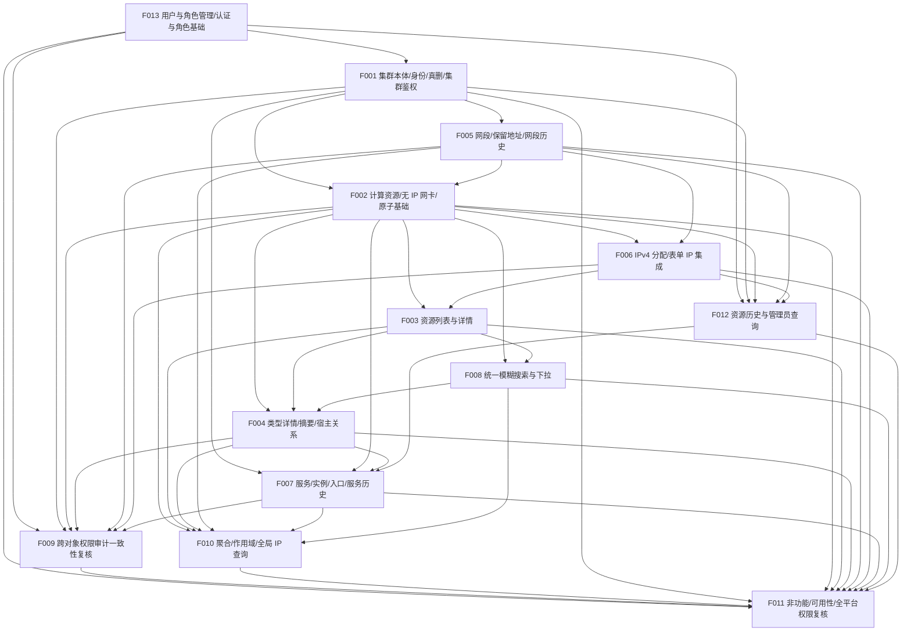

# CSM V2 计划 revision 8 提案（候选 — 待用户批准）

> Status: **PROPOSED — 待用户批准**。本文件是 revision 8 的完整变更提案，**不是**机器状态，**不称 ACCEPTED**，**不改动基线**。当前唯一已批准基线仍为 `docs/project/project-plan.yaml`（revision 7，`ACCEPTED`，2026-09-25）。批准后由协调器在**单独批准**前提下把 revision 8 落稿到 `project-plan.yaml` 并同步三份派生视图。
> Document Type: Project Plan Change Proposal
> Basis: `docs/product/requirements-v2.md`（BQ-M–BQ-**V** 已确认；§10 场景 **1–81**，新增 §4.9、场景 72–81）与 `docs/product/domain-model.md`（§2.1 平台主体与权限已落稿）
> 机器状态唯一来源为 `docs/project/project-plan.yaml`（revision 7，`ACCEPTED`）；派生视图见 `docs/project/backlog.md`、`docs/project/dependency-map.md`、`docs/project/milestones.md`。
> 本文件**不写入**任何 `git`/`evidence`/Test/Review/DONE 证据，也不启动实施；执行检查点保持为空。**本提案不修改机器计划与三份派生视图。**

---

## 0. 本轮结论摘要

- 用户裁定 **BQ-V**（2026-09-25，产品文档已落稿）：新增范围 **F013「用户与角色管理」**（P0）；认证源确定为**平台自建用户管理**（不接入组织认证），对应 `requirements-v2.md` §2.1、§3.1、§4.9、§9.1–§9.3、§10 场景 **72–81**。
- 4 项项目级架构决策 **D-ARCH-STACK / D-ARCH-DB / D-ARCH-API / D-ARCH-DEPLOY** 及 **D-BQ-F** 已由用户批准，本提案作为**已确认决策**引用并在 `decisions_required` 中置 **RESOLVED**；**从所有 Feature 的 `blocking_decisions` 移除 `D-BQ-F`**。
- **依赖判断（核心）**：自建用户、登录/会话与单一角色是**平台访问控制的基础**，必须先于任何受管对象的服务端鉴权。故：
  1. **F013 成为新的根（`depends_on: []`）**，并**接管原 F001 的“平台角色/操作者解析基础”**（列表/管理对象鉴权只做业务授权，身份与角色判定来自 F013）。
  2. **F001 `depends_on` 由 `[]` 调整为 `[F013]`**（集群本体最小服务端鉴权复用 F013 的身份/角色/会话基础）。
  3. **F009 `depends_on` 增 F013**（跨对象权限/审计一致性复核直接复核 F013 的权限/会话基础，场景 40）。
  4. **F011 `depends_on` 增 F013**（全平台三角色终局复核含用户/角色/登录，场景 57）。
  5. **F012 `depends_on` 增 F013**（管理员可查历史复用 F013 的角色/操作者判定，场景 48/61/64）。
  6. F002/F005/F006/F007 仍经 F001 传递获得 F013 基础，**不新增冗余直边**（避免假依赖）。
- 覆盖 `requirements-v2.md §10` 全部 **81 条**验收场景，逐条重算 `participants` / `closure_owner` / `parts`；场景 **72–81 归 F013 闭环**；因“角色/操作者判定”加入 **F013 participant** 的场景为 **40、48、57、61、64、71**。`gaps: []`。
- 依赖为**无环有向图**；新增根 F013，拓扑序为 `F013 → F001 → F005 → F002 → F006 → F012 → F003 → F008 → F004 → F007 → F009 → F010 → F011`。**无 closure 早于其 participants**，**无 scope 早于或晚于其生产对象**。
- **Milestone 重算**：F013 归入 **M1**（平台基础），M1 退出场景 34 → **44**（+72–81）；分布 **M1 44 / M2 9 / M3 21 / M4 7 = 81**。
- **rule_sections 重挂**：新增 **`§4.9 用户与角色管理`**（键数 31 → **32**）；`§2.1 角色与首期权限`、`§3.1 P0 交付内容与边界`、`§9.1 安全` 纳入 F013。
- 项目状态：revision 7 仍为唯一已批准的 `ACCEPTED` 基线；本候选为待批准候选（**PROPOSED — 待用户批准**），机器计划、派生视图与执行检查点均**未改变**。
- 全部 Feature 仍记 `BLOCKED`（产品 `OPEN` 未裁定、依赖未 DONE）；计划候选“可送审”不等于任何 Feature READY。D-ARCH-* 已裁定 ≠ 架构/契约文档已产出，`contract.status` 仍为 BLOCKED（理由改为“契约文档待产出”）。

---

## 1. 权威输入与裁定边界

- **产品事实**：`docs/product/requirements-v2.md`（§11.1 BQ-M–BQ-V、§11.2 OPEN、§10 场景 1–81）与 `docs/product/domain-model.md`（§2.1 User/Role，`PROPOSED` 主体、不属于受管资源）。本提案不重复维护详细规则，只引用。
- **管理规则**：`docs/project/project-state.md`（字段、状态、证据映射）、`docs/project/handoff.md`、`docs/project/git-workflow.md`、`.pi/prompts/project.md`。
- **本候选引用到的已确认关键裁定**（不新增、不改写）：
  1. **BQ-V（本轮核心）**：平台**自建用户管理**，不接入组织既有认证方式；P0 能力为**用户增删改、单一角色分配、改密/重置、登录/登出、账号禁用**；仅平台管理员维护、服务端校验；**删除用户保留历史审计且用户名不复用**；**禁用≠删除**；口令最短 8 位含字母+数字、P0 不强制定期过期、可自助改密、无自助找回；用户/角色管理操作进审计且**不并入仅管理员可查的受管资源历史**；首个平台管理员部署预置、首登改密（§4.9、场景 72–81）。
  2. BQ-V 同时确认：审计/资源历史**长期保留、不自动到期、仅管理员可查**；性能目标**列表/详情 P95 < 1s、搜索 P95 < 1.5s**；部署**仅内网 HTTP、不启用 HTTPS**；**不做备份/恢复演练**（§9.1–§9.3），关闭 §11.2 `BQ-F`。
  3. 既有已确认裁定（BQ-H–BQ-U）继续有效：全部受管资源仅真实删除、逐项先删、无恢复；集群 `code`/服务编号不复用；资源历史仅管理员可查、不自动到期；平台统一三角色、集群选择非授权边界（§2.1）。
- **已批准的 4 项项目级架构决策**（本提案引用并置 RESOLVED，不自行代填）：
  - **D-ARCH-STACK**：后端 Python 3.12 + FastAPI + Pydantic v2 + SQLAlchemy 2（P0 不启用 Alembic 迁移，绿地用初始化建表，后续结构变更走显式流程）；前端 Vue 3 + TypeScript + Vite + Element Plus + Pinia + Vue Router。
  - **D-ARCH-DB**：PostgreSQL 唯一主库；真删业务表 + 独立保留标识表（集群 `code`、服务编号真删后不复用）+ 追加历史/审计表；比较键单独存储，展示保留用户输入形态。
  - **D-ARCH-API**：REST + OpenAPI；整单更新用**显式子项操作（增/改/删）**；乐观锁版本、冲突 `409`、`application/problem+json` 字段级错误；offset 分页。
  - **D-ARCH-DEPLOY**：内网 + 反向代理；Docker Compose（不强制 K8s）；dev/staging/prod；**仅 HTTP 不启用 HTTPS**；**不做备份/恢复演练**。
- **边界**：本提案不做产品/架构裁定。凡需求未确认的口径（§11.2）只登记为待决策并挂阻塞，不据通用经验补齐。身份、角色判定与会话基础集中由 **F013** 交付；各受管对象的服务端业务授权、操作审计与历史写入**随对象在对应 Feature 当期落地**（F001/F002/F005/F006/F007），不先于对象创建、也不延后到 F009/F011。

---

## 2. 项目状态与证据现状（核对结论）

| 项目 | 现状（本提案核对） |
| --- | --- |
| 机器计划 | `docs/project/project-plan.yaml` **revision 7 `ACCEPTED`**（2026-09-25）；本次**未修改** |
| 计划 revision | 7（已批准历史基线）；revision 8 为**候选**，未批准、未生效 |
| Feature 数 | revision 7：12 个；revision 8 候选：**13 个**（F001–F012 稳定 ID 不变，F013 为递增新增） |
| 需求映射 | revision 7：71 条；revision 8 候选：**81 条**（§10 全部，新增 72–81） |
| 架构决策 | revision 7：D-ARCH-* / D-BQ-F **OPEN**；revision 8 候选：上述 5 项 **RESOLVED**，其余不变 |
| Feature 状态 | revision 7 与候选均为**全部 `BLOCKED`**（依赖未 DONE 且 §11.2 产品 OPEN 未裁定）；候选“可送审”不代表任何 Feature READY |
| READY | 无 |
| 执行检查点 | `execution.current_feature: null`、`execution.current_stage: null`（未启动任何 Feature） |
| 交付证据 | **无**：v2 分支仅脚手架；无实现、无测试、无 Review、无合并、无 Feature `git` 字段。需求/领域/提案文件在工作区未提交，不构成 DONE |
| 派生视图 | `backlog.md` / `dependency-map.md` / `milestones.md` 仍为 revision 7；候选生效前**不冒充已同步** |
| 产品文档状态 | `requirements-v2.md` = PARTIALLY CONFIRMED（BQ-V 已落稿，新增 §4.9、场景 72–81，§11.2 仍有 OPEN）；`domain-model.md` 同步 BQ-V |

---

## 3. revision 7 → revision 8 候选：变更清单

### 3.1 产品范围文本变更（批准后需写入 `project-plan.yaml.scope.included`）

| # | revision 7 | revision 8 候选 |
| --- | --- | --- |
| S1 | 无平台自建用户/角色能力；认证源 `OPEN` | **新增平台自建用户与角色管理**：用户增删改、单一角色（查看者/资源维护者/平台管理员）分配、登录/登出、改密/重置、账号禁用；仅平台管理员维护、服务端校验；**删除用户保留审计且用户名不复用**、**禁用≠删除**；首个管理员部署预置、首登改密 |
| S2 | 无口令策略 | **口令策略**：最短 8 位且同时含字母与数字；P0 不强制定期过期；可自助改密；平台管理员可重置；无自助找回 |
| S3 | 权限/审计基础由 F001 作为“平台角色/操作者解析基础” | 平台**身份/角色判定与会话基础由 F013 交付**；F001 及后续对象 Feature 复用；**用户/角色管理操作进审计（§9.1），不并入仅管理员可查的受管资源历史** |
| S4 | §9.2 正式延迟目标待部署测量 | **性能目标**：常用列表/详情 P95 < 1s、搜索 P95 < 1.5s（约 1,000 台/集群基线） |
| S5 | §9.1/§9.3 部署与备份待定 | **仅内网 HTTP、不启用 HTTPS**（接受明文风险）；**P0 不做备份、不做恢复演练**（接受数据丢失风险）；该取舍不降低并发保护与整单原子要求 |
| S6 | 认证源、审计期限、备份、延迟目标为 `OPEN`（D-BQ-F） | **BQ-F 关闭**：认证源＝平台自建；审计/资源历史长期保留、不自动到期、仅管理员可查；性能目标如上；不做备份 |

> 以上均为**已确认需求的落地重述**，不是本提案新增规则。revision 7 的 `excluded`（导入导出、批量更新、告警、DHCP、自动部署等）不变；P0 明确排除（不构成永久排除）：组织认证/SSO/LDAP/AD、自助注册、口令找回、MFA、按集群/资源细粒度授权。

### 3.2 Feature / 依赖 / 决策 / 映射变更

| # | revision 7 | revision 8 候选 | 理由 |
| --- | --- | --- | --- |
| N1 | 无 F013 | **新增 F013「用户与角色管理」**（Epic E8、M1、`dep []`、P0、`BLOCKED`） | BQ-V 新增 §4.9/场景 72–81 的独立 P0 能力 |
| N2 | F001 `dep []`，交付“平台角色/操作者解析基础” | **F001 `dep [F013]`**；F001 只交付**集群本体最小服务端鉴权/审计/历史写入**，“角色/操作者解析与会话基础”改由 F013 交付 | 自建用户/登录/角色是访问控制基础，必须先于对象鉴权；避免身份与业务授权混在集群 Feature |
| N3 | F009 `dep [F001,F002,F004,F005,F006,F007]`，复核 F001 角色基础 | **F009 `dep [F013,F001,F002,F004,F005,F006,F007]`**，复核 F013 权限/会话基础 + F001/F002/F005/F006/F007 对象鉴权 | 跨对象一致性复核须覆盖新增的认证/角色来源（场景 40） |
| N4 | F011 `dep [F001,…,F012]` | **F011 `dep [F013,F001,…,F012]`** | 全平台三角色终局复核含用户/角色/登录（场景 57） |
| N5 | F012 `dep [F001,F002,F005,F006]` | **F012 `dep [F013,F001,F002,F005,F006]`** | 管理员可查历史的角色/操作者判定来自 F013（与 48/61/64 participant 一致） |
| N6 | F001/F002/F005/F006/F007/F009/F011/F012 `blocking_decisions` 含 `D-BQ-F` | **全部移除 `D-BQ-F`** | BQ-V 关闭 BQ-F |
| N7 | D-ARCH-STACK/DB/API/DEPLOY、D-BQ-F 均 `OPEN` | 上述 5 项 **`RESOLVED`**（附依据） | 用户已批准项目级架构决策与 BQ-F |
| N8 | `rule_sections` 31 键 | **新增 `§4.9 用户与角色管理`**；`§2.1`/`§3.1`/`§9.1` 纳入 F013；键数 31 → **32** | §4.9 为新增规则章节，F013 承接认证/角色/审计 |
| N9 | 场景 1–71 | **场景 1–81**；**72–81 归 F013**；`participants` 增补 F013 的场景 **40/48/57/61/64/71** | §10 扩展与认证/角色判定来源 |
| N10 | M1 特征 `[F001,F005,F002,F006,F012,F003]`，退出 34 条 | **M1 特征增 F013（置首）**；退出 34 → **44** 条；分布 **44/9/21/7 = 81** | F013 归平台基础 Milestone |
| N11 | — | `scope.included` 增补 S1–S6；`D-NAME-COMPARISON`、`D-RESOURCE-HISTORY` 的 `affects` 增 F013 | 用户名比较口径与审计载体影响 F013 |
| N12 | — | `planning_audit` 新增 revision 8 记录（basis_commit `45acff1`），revision 7 审计转 `superseded` | 规划变更留痕 |

> **未变更**：Feature 数量原则（不把数据库/API/页面拆成独立 Feature）、Epic 能力域方法、P0/P1/P2 分级原则、`excluded` 清单、Git 与实施门禁。F001–F012 的稳定 ID 不变；F013 为递增新增；新增 Epic **E8「平台访问控制与用户管理」**（用户/角色属平台访问控制主体，不属于受管资源，与原 E7“资源历史/复核/非功能”区分）。

---

## 4. revision 8 候选 Feature 清单（13 个，稳定 ID）

> 记号：`dep` = `depends_on`；`D-*` = 阻塞决策；“闭环场景”= 本 Feature DONE 时主要闭环归属它的 §10 场景；`联验 parts`= 与其它 Feature 分担的验收部分。全部 Feature **P0 / status `BLOCKED`**；无 `git`/`evidence`；`contract.status: BLOCKED`（契约文档待产出，理由不再写“API 规范未批准”）。

### F013 用户与角色管理（新增）
- **Title** 用户与角色管理
- **Epic** E8（平台访问控制与用户管理） · **Milestone** **M1** · **dep** `[]`（**根**）
- **Goal**：交付平台**自建用户与角色管理**与**平台角色/操作者解析与会话基础**：用户增删改、单一角色分配、登录/登出、改密/重置、账号禁用；仅平台管理员维护、服务端校验；删除用户保留审计且用户名不复用；禁用≠删除；作为全部受管对象服务端鉴权与操作审计的身份前提。
- **Scope**：
  - 用户增删改（用户名 + 初始口令 + 单一角色）；用户名在仍存用户中唯一（大小写/首尾空格比较口径按 D-NAME-COMPARISON）。
  - **单一角色**（运维查看者 / 资源维护者 / 平台管理员）；角色分配后新操作按新角色鉴权、旧角色不再生效；集群选择不是授权边界。
  - **登录/登出**：已启用账号 + 正确口令登录并建立会话；禁用/未知账号或错误口令不建立会话、不创建/修改业务数据；登出后原会话失效，再访问受保护资源须重新登录。
  - **账号禁用**：禁止登录但保留用户记录，可重新启用；与删除不同。
  - **删除用户**：移除账号、不能登录；其历史操作与审计保留；**用户名不复用**。
  - **口令策略**：最短 8 位且同时含字母与数字；P0 不强制定期过期；用户可自助改密，平台管理员可重置；无自助找回。
  - **维护权限**：用户增删改、角色分配、改密/重置、禁用/启用**仅平台管理员可执行**，关键权限由服务端校验；查看者与维护者越权请求被拒绝且数据不变。
  - **审计**：用户与角色管理操作按 §9.1 记录操作者、时间与关键变更；**不并入仅管理员可查的受管资源历史**。
  - **首个管理员**由部署/初始化预置，首登须修改初始口令。
  - 交付**平台角色/操作者解析与会话基础**，供 F001/F002/F005/F006/F007/F012 复用（受管资源业务授权仍由各对象 Feature 实施）。
- **Out of scope**：组织认证/SSO/LDAP/AD 对接、自助注册、口令找回、MFA、按集群或资源的细粒度授权（P0 不含，不构成永久排除）；受管资源的业务鉴权/审计/历史写入（F001/F002/F005/F006/F007）；跨对象权限/审计一致性复核（F009）；全平台终局复核（F011）；资源历史查询（F012）。
- **Acceptance**：
  - `requirements-v2.md §2.1`（认证源＝平台自建；统一三角色）
  - `requirements-v2.md §3.1`（用户与角色管理模块）
  - `requirements-v2.md §4.9`（用户与角色管理）
  - `requirements-v2.md §9.1`（登录/会话/口令与用户管理审计）
  - `requirements-v2.md §10` 场景 72–81
- **Acceptance_scenarios**：`"72" "73" "74" "75" "76" "77" "78" "79" "80" "81"`
- **Acceptance_note**：场景 80 的越权拒绝由本 Feature 服务端实现并闭环；跨对象权限一致性复核见 F009（场景 40），全平台终局复核见 F011（场景 57）。用户名比较口径依赖 D-NAME-COMPARISON，审计载体依赖 D-RESOURCE-HISTORY。本 Feature 交付的角色/操作者解析与会话基础被 F001/F002/F005/F006/F007/F012 复用；用户/角色管理操作进审计但不并入受管资源历史（场景 81）。
- **Blocking_decisions**：`[D-NAME-COMPARISON, D-RESOURCE-HISTORY]`
- **Status**：`BLOCKED`
- **Layers**：`{database: true, backend: true, frontend: true}`
- **Implementation**：`{database_design: PENDING, backend: PENDING, frontend: PENDING, test: PENDING, review: PENDING}`

### F001 集群登记、身份、真实删除保护与集群本体权限审计（调整）
- **Epic** E1 · **Milestone** M1 · **dep** **`[F013]`**（原 `[]`）
- **阻塞决策** D-NAME-COMPARISON, D-CODE-FORMAT, D-DELETE-CONFIRMATION, D-DELETE-DEPENDENCIES, D-RESOURCE-HISTORY（**移除 D-BQ-F**）
- **调整**：不再交付“平台角色/操作者解析与会话基础”，改为**复用 F013 交付的基础**；保留集群 `code`/名称/用途登记与身份、真实删除保护（仍存业务关联先显式逐项删除/解除、不级联、已解除历史不阻止、`code` 永不复用、名称可复用）、**集群本体最小服务端三角色鉴权**、集群操作审计与删除/变更历史写入。
- **闭环场景**：71。**联验 parts**：50/58（集群规则侧）、59（上级先删规则侧）、61/64（集群历史写入侧，管理员查询在 F012 后联验）、40（集群切换/记忆与角色基础侧，角色基础来自 F013）、57（集群本体鉴权侧）。

### F002 计算资源登记、无 IP 网卡与一次原子提交基础（调整）
- **Epic** E2 · **Milestone** M1 · **dep** `[F001, F005]`（经 F001 传递 F013）
- **阻塞决策** D-STATUS-SOURCE, D-NAME-COMPARISON, D-IP-SEMANTICS, D-DELETE-DEPENDENCIES, D-DELETE-CONFIRMATION, D-RESOURCE-HISTORY（**移除 D-BQ-F**）
- **调整**：`scope` / `acceptance_note` 中“复用 **F001** 交付的角色/操作者解析基础”改为“复用 **F013** 交付、经 F001 集成的角色/操作者解析与会话基础”；其余不变。
- **闭环场景**：28、29、34、47、50。

### F003 计算资源统一列表、详情与服务端分页（不变）
- **Epic** E2 · **Milestone** M1 · **dep** `[F002, F006]` · **阻塞决策** D-STATUS-SOURCE（不变）
- **闭环场景**：8、32。

### F004 类型详情、列表/详情类型摘要与宿主关系（不变）
- **Epic** E3 · **Milestone** M2 · **dep** `[F002, F003, F008]`
- **阻塞决策** D-Q3, D-RESOURCE-REASSIGN, D-DELETE-DEPENDENCIES（不变）
- **闭环场景**：1、2、13、14、15、33、35、36。

### F005 网段、保留地址与网段历史写入（调整）
- **Epic** E4 · **Milestone** M1 · **dep** `[F001]`（经 F001 传递 F013）
- **阻塞决策** D-NAME-COMPARISON, D-DELETE-DEPENDENCIES, D-DELETE-CONFIRMATION, D-RESOURCE-HISTORY（**移除 D-BQ-F**）
- **调整**：`scope` 中“复用 **F001** 角色基础”改为“复用 **F013** 交付、经 F001 集成的角色/操作者解析与会话基础”；其余不变。
- **闭环场景**：10、12、53。

### F006 IPv4 分配与同一表单 IP 集成（调整）
- **Epic** E4 · **Milestone** M1 · **dep** `[F002, F005]`
- **阻塞决策** D-IP-SEMANTICS, D-DELETE-DEPENDENCIES, D-DELETE-CONFIRMATION, D-RESOURCE-HISTORY（**移除 D-BQ-F**）
- **调整**：`scope` 中角色基础来源改为 **F013**（经 F001 集成）；其余不变。
- **闭环场景**：3、4、9、11、19–21、24–27、30、31、43、44、45、52、60、62、65。

### F007 服务、部署实例、访问入口与服务历史（调整）
- **Epic** E5 · **Milestone** M3 · **dep** `[F001, F002, F004, F012]`（经 F001 传递 F013）
- **阻塞决策** D-BQ-E, D-SERVICE-DETAILS, D-NAME-COMPARISON, D-RESOURCE-REASSIGN, D-DELETE-DEPENDENCIES, D-DELETE-CONFIRMATION, D-RESOURCE-HISTORY（**移除 D-BQ-F**）
- **调整**：`scope` 中角色基础来源改为 **F013**（经 F001 集成）；其余不变。
- **闭环场景**：5、6、16、17、18、42、46、49、51、54、58、59、63、67、68、69、70。

### F008 统一模糊搜索与下拉交互（不变）
- **Epic** E6 · **Milestone** M2 · **dep** `[F002, F003]` · **阻塞决策** 无
- **闭环场景**：41。

### F009 跨对象权限审计一致性复核与集群切换验收（调整）
- **Epic** E7 · **Milestone** M3 · **dep** **`[F013, F001, F002, F004, F005, F006, F007]`**（增 F013）
- **阻塞决策** **无**（**移除 D-BQ-F**）
- **调整**：复核对象由“F001 平台角色/操作者解析基础 + F002/F005/F006/F007 对象鉴权”改为“**F013 平台自建用户/角色/登录会话基础** + F001 集群本体鉴权 + F002/F005/F006/F007 各自对象鉴权/审计 的一致性”，仍**只复核、不实施**基础鉴权。
- **闭环场景**：40（participants 增 F013）。

### F010 集群聚合概览、查询作用域与全局 IP 查询（不变）
- **Epic** E1 · **Milestone** M3 · **dep** `[F002, F003, F004, F005, F007, F008]` · **阻塞决策** 无
- **闭环场景**：55、56、66。

### F011 非功能、可用性基线与全平台权限复核（调整）
- **Epic** E7 · **Milestone** M4 · **dep** **`[F013, F001, F002, F003, F004, F005, F006, F007, F008, F009, F010, F012]`**（增 F013）
- **阻塞决策** **无**（**移除 D-BQ-F**）
- **调整**：全平台终局复核（场景 57）纳入 **F013 用户/角色/登录服务端鉴权**；`out_of_scope` 增“用户/角色/认证实现（F013 交付）”；其余不变。
- **闭环场景**：7、22、23、37、38、39、57（participants 增 F013）。

### F012 资源历史保留与管理员查询（调整）
- **Epic** E7 · **Milestone** M1 · **dep** **`[F013, F001, F002, F005, F006]`**（增 F013）
- **阻塞决策** D-RESOURCE-HISTORY（**移除 D-BQ-F**）
- **调整**：管理员读权限的角色/操作者判定来源改为“**F013** 交付的角色/操作者解析基础（经 F001 集成）”；其余不变。
- **闭环场景**：48、61、64（participants 均增 F013）。

---

## 5. 依赖图与 DAG 校验

### 5.1 候选依赖边

| Feature | depends_on |
| --- | --- |
| F013 | —（根） |
| F001 | F013 |
| F002 | F001, F005 |
| F003 | F002, F006 |
| F004 | F002, F003, F008 |
| F005 | F001 |
| F006 | F002, F005 |
| F007 | F001, F002, F004, F012 |
| F008 | F002, F003 |
| F009 | F013, F001, F002, F004, F005, F006, F007 |
| F010 | F002, F003, F004, F005, F007, F008 |
| F011 | F013, F001, F002, F003, F004, F005, F006, F007, F008, F009, F010, F012 |
| F012 | F013, F001, F002, F005, F006 |

### 5.2 DAG 校验

- **唯一根**：`F013`（无前置）。拓扑序（一个合法解）：
  `F013 → F001 → F005 → F002 → F006 → F012 → F003 → F008 → F004 → F007 → F009 → F010 → F011`
- **无环**：每条边指向拓扑序中更晚的节点。F013 位于 F001 之前；F009/F011 位于 F013 与全部对象 Feature 之后。
- **关键路径**：`F013 → F001 → F005 → F002 → F006 → F003 → F008 → F004 → F007 → F009 → F011`。
- **无假依赖**：F002/F005/F006/F007 未直接列 F013，而是经 F001 传递获得身份/角色/会话基础（避免重复直边）；F009/F011/F012 因**直接复核/消费** F013 输出而显式依赖（与 participants 一致）。F013 不依赖任何受管对象（用户/角色不属于受管资源）。
- **无 scope 早于或晚于生产对象**：F013 只含平台访问控制主体；F001 及后续对象在各自对象当期实施业务鉴权/审计/历史写入；F009 在对象就绪后只做一致性复核；F012 在其依赖对象交付后、F009 之前提供管理员历史查询；F011 最后复核。
- **“closure 不早于 participants”**：见 §9 逐条核验。重点：71 → 闭环 F001 晚于新增 participant F013；40 → F009 晚于 F013；57 → F011 晚于 F013；48/61/64 → F012 晚于 F013；72–81 → F013 自身闭环。

### 5.3 Mermaid



---

## 6. Milestone 候选与退出标准

> Milestone 按产品可交付能力组织；任一 Milestone 的 Feature 只依赖本 Milestone 或更早的 Feature；退出标准只引用**本 Milestone 内闭环（closure_owner）**的场景。

### M1 — 平台访问控制、集群本体、资源网络台账与资源历史
- **Feature**：**F013**、F001、F005、F002、F006、F012、F003
- **Milestone 内顺序**：`F013 → F001 → F005 → F002 → F006 → {F012, F003}`
- **目标**：先由 F013 交付平台自建用户/角色管理与登录会话基础；再由 F001 复用该基础交付集群本体与最小服务端鉴权/审计/历史；再打通网段台账、计算资源一次原子录入（公共信息 + 全部网卡 + 全部 IP）与统一列表/详情，并由 F012 提供管理员历史查询。
- **退出标准（闭环场景，共 44 条）**：3、4、8、9、10、11、12、19、20、21、24、25、26、27、28、29、30、31、32、34、43、44、45、47、48、50、52、53、60、61、62、64、65、71、**72、73、74、75、76、77、78、79、80、81**。
- **M1 内联验 parts**：2、5、6、40（角色基础/集群切换）、42、51、55、56、59、68 等（见 §7）。
- **产出保证**：M1 退出时平台支持自建用户/单一角色/登录登出、口令策略与禁用/删除语义、首个管理员预置；同一表单支持一次录入公共信息 + 全部网卡 + 全部 IP；普通列表仅返回仍存对象；管理员可查已交付对象历史且非管理员被拒、历史不自动清除；F013/F001/F002/F005/F006 各自已在服务端实现本对象三角色鉴权与操作审计/历史写入（不等待 F009）。
- **前置决策**：D-STATUS-SOURCE、D-NAME-COMPARISON、D-CODE-FORMAT、D-IP-SEMANTICS、D-DELETE-*、D-RESOURCE-HISTORY（D-ARCH-* 与 D-BQ-F 已 RESOLVED）。

### M2 — 统一检索、类型详情与宿主关系
- **Feature**：F008、F004
- **Milestone 内顺序**：`F008 → F004`
- **退出标准（闭环场景，共 9 条）**：1、2、13、14、15、33、35、36、41。
- **M2 内联验 parts**：6、18、37、38、40、42、59、68（VM/网卡/IP 侧）。
- **前置决策**：D-Q3、D-DELETE-DEPENDENCIES、D-RESOURCE-REASSIGN（= F004 `blocking_decisions` 的完整集合；F008 无阻塞决策）。

### M3 — 服务、服务历史、跨对象权限复核与集群导航
- **Feature**：F007、F009、F010
- **Milestone 内顺序**：`F007 → {F009, F010}`
- **退出标准（闭环场景，共 21 条）**：5、6、16、17、18、40、42、46、49、51、54、55、56、58、59、63、66、67、68、69、70。
- **M3 内联验 parts**：40（跨对象一致性复核侧）、46（关联保护侧）、51（服务关联部分）、59（其它对象子项）、61/64（服务历史写入侧）、66（零关联服务生命周期侧）、68（部署关系侧）、57（各对象鉴权一致性复核侧）。
- **前置决策**：D-BQ-E、D-SERVICE-DETAILS、D-NAME-COMPARISON、D-RESOURCE-REASSIGN、D-DELETE-*、D-RESOURCE-HISTORY。

### M4 — 非功能、可用性基线与全平台权限复核
- **Feature**：F011
- **退出标准（闭环场景，共 7 条）**：7、22、23、37、38、39、57。
- **前置决策**：无（D-ARCH-*、D-BQ-F 已 RESOLVED；产品 OPEN 项非 M4 阻塞，但其实现须已在各对象阶段裁定）。

### Milestone 闭环分布核对

| Milestone | 闭环场景数 | 场景 |
| --- | --- | --- |
| M1 | **44** | 3,4,8,9,10,11,12,19,20,21,24,25,26,27,28,29,30,31,32,34,43,44,45,47,48,50,52,53,60,61,62,64,65,71,72,73,74,75,76,77,78,79,80,81 |
| M2 | 9 | 1,2,13,14,15,33,35,36,41 |
| M3 | 21 | 5,6,16,17,18,40,42,46,49,51,54,55,56,58,59,63,66,67,68,69,70 |
| M4 | 7 | 7,22,23,37,38,39,57 |
| 合计 | **81** | §10 全部场景，无遗漏；44+9+21+7 = 81 |

---

## 7. §10 场景 1–81：候选 closure_owner / participants / parts

> `closure_owner` = 本场景主要验收闭环归属的 Feature（其 DONE 时依赖已满足）。`parts` = 参与但不在该 Feature 闭环的联验部分。除标注新增/变更者外，1–71 映射沿用 revision 7。所有场景文本以 `requirements-v2.md §10` 为准。

### 7.1 变更/新增场景（本次重点）

| # | participants | closure_owner | parts（联验） |
| --- | --- | --- | --- |
| **40** | **F013**, F001, F002, F004, F005, F006, F007, F009 | F009 | F013 用户/角色与登录会话基础（角色判定来源）、F001 集群切换/记忆与集群本体鉴权、F002/F005/F006/F007 各对象服务端鉴权在切换下不变、F009 跨对象一致性复核 |
| **48** | **F013**, F002, F006, F012 | F012 | F013 角色/操作者解析与管理员判定基础、F002 资源真删/无恢复/历史写入、F006 IP 历史写入、F012 管理员查询/无到期 |
| **57** | **F013**, F001, F002, F005, F006, F007, F009, F011 | F011 | F013 自建用户/角色/登录服务端鉴权、F001 平台角色/集群本体鉴权、F002/F005/F006/F007 各对象当期服务端鉴权与关联保护下的删除授权、F009 跨对象一致性复核、F011 全平台端到端复核 |
| **61** | **F013**, F001, F002, F005, F006, F012 | F012 | F013 角色/操作者解析（管理员判定）、F001/F002/F005/F006 历史写入、F012 管理员可查/非管理员拒绝/无到期（服务侧历史见 63/67/69/70） |
| **64** | **F013**, F001, F002, F005, F006, F012 | F012 | F013 角色/操作者解析（管理员判定）、F001/F002/F005/F006 历史写入、F012 无到期/权限拒绝/审计字段（服务侧历史见 63/67/69/70） |
| **71** | **F013**, F001 | F001 | F013 角色/操作者解析与会话基础（三角色判定）、F001 集群本体新增/编辑/删除、最小三角色服务端鉴权、集群审计与历史写入；管理员查询由 61/64 联验（F012），关联后改名归属按场景 58 由 F007 联验 |
| **72–81** | 见下 | **F013** | — |

**场景 72–81（全部 closure_owner = F013，participants = [F013]）**：

| # | 场景要点（详见 §10） |
| --- | --- |
| 72 | 已启用账号 + 正确口令登录成功建立会话；未知/错误口令被拒、不建会话、不改业务数据 |
| 73 | 禁用账号 + 正确口令登录被拒，不建会话 |
| 74 | 登出后原会话失效，再访问受保护资源被拒、须重新登录 |
| 75 | 管理员新增用户（用户名 + 初始口令 + 单一角色）后可登录；同名/非法用户名按唯一性规则被拒 |
| 76 | 管理员修改用户信息与角色分配；新操作按新角色鉴权、旧角色失效 |
| 77 | 管理员删除用户后不能登录、其它用户与数据不受影响；历史操作/审计保留、用户名不得复用 |
| 78 | 管理员改密/重置；旧口令失效、新口令可登录、其它用户不受影响；用户可自助改密（最短 8 位含字母+数字、无过期、无自助找回） |
| 79 | 管理员禁用账号；禁用后不能登录、记录保留、可重新启用；禁用≠删除 |
| 80 | 越权拒绝：查看者/维护者直接调用用户新增/修改/删除、角色分配、重置口令、禁用/启用接口，全部由服务端拒绝、数据不变 |
| 81 | 用户/角色管理操作按 §9.1 记录操作者、时间、关键变更；进审计但不并入仅管理员可查的受管资源历史 |

### 7.2 场景 1–71 完整映射（沿用 revision 7，仅 40/48/57/61/64/71 增 F013）

| # | participants | closure_owner | parts（联验） |
| --- | --- | --- | --- |
| 1 | F002, F003, F004, F006 | **F004** | F002 公共信息/表单、F003 列表/详情框架、F006 网卡/IP 录入与原子 |
| 2 | F002, F004 | **F004** | F002 同名裸金属/名称唯一、F004 同名 VM（含必填宿主） |
| 3 | F006 | **F006** | — |
| 4 | F006 | **F006** | — |
| 5 | F002, F007 | **F007** | F002 改名后网卡/IP 归属、F007 改名后服务部署归属 |
| 6 | F002, F004, F007, F012 | **F007** | F002 删除后列表/子项、F004 VM 依赖、F007 服务实例依赖、F012 历史保留查询 |
| 7 | F003, F006, F010, F011 | **F011** | F003 列表/分页、F006 IP 数据、F010 全局 IP、F011 千节点端到端 |
| 8 | F003 | **F003** | — |
| 9 | F002, F005, F006 | **F006** | F002 同表单重复接口、F005 CIDR 语法、F006 IPv4/前缀/重复 IP |
| 10 | F005 | **F005** | — |
| 11 | F005, F006 | **F006** | F005 CIDR/跨集群网段规则、F006 越界 IP/跨集群关联 |
| 12 | F005 | **F005** | — |
| 13 | F002, F003, F004, F006 | **F004** | F002/F003 表单/详情框架、F006 网卡/IP 录入、F004 双向查看闭环 |
| 14 | F004, F006 | **F004** | F006 IP 冲突、F004 跨集群宿主/VM 约束 |
| 15 | F004 | **F004** | — |
| 16 | F007 | **F007** | — |
| 17 | F007 | **F007** | — |
| 18 | F004, F007 | **F007** | F004 VM 关联拒绝、F007 服务实例关联拒绝与闭环 |
| 19 | F006 | **F006** | — |
| 20 | F005, F006 | **F006** | F005 保留/网关/网络广播规则、F006 拒绝行为 |
| 21 | F005, F006 | **F006** | F005 范围/保留规则、F006 自动分配次序与拒绝 |
| 22 | F006, F011 | **F011** | F006 并发唯一实现、F011 端到端复核 |
| 23 | F006, F011 | **F011** | F006 耗尽不残留实现、F011 端到端复核 |
| 24 | F006 | **F006** | — |
| 25 | F006 | **F006** | — |
| 26 | F005, F006 | **F006** | F005 网段真删/历史不构成在用、F006 已分配地址前置拒绝与释放 |
| 27 | F005, F006 | **F006** | F005 保留/网关规则、F006 与现有分配冲突检查 |
| 28 | F002, F005 | **F002** | F005 网段属性、F002 技术/用途/前缀/网关带出 |
| 29 | F002 | **F002** | — |
| 30 | F002, F006 | **F006** | F002 无 IP 网卡/0..1 网段、F006 分配前必选网段 |
| 31 | F006 | **F006** | — |
| 32 | F003 | **F003** | — |
| 33 | F002, F003, F004 | **F004** | F002 字段容器、F003 详情框架、F004 类型专有字段 |
| 34 | F002 | **F002** | — |
| 35 | F004, F008 | **F004** | F008 搜索输入、F004 宿主查找与去重 |
| 36 | F004, F008 | **F004** | F008 IP 匹配、F004 资源去重 |
| 37 | F004, F007, F008, F010, F011 | **F011** | F008 已交付对象、F004 宿主、F007 服务/实例、F010 全局 IP、F011 全量复核 |
| 38 | F004, F007, F008, F010, F011 | **F011** | F008 已交付对象全量模糊、F004 宿主、F007 服务/实例、F010 全局 IP、F011 全量复核 |
| 39 | F008, F011 | **F011** | F008 竞态防护实现、F011 端到端复核 |
| 40 | **F013**, F001, F002, F004, F005, F006, F007, F009 | **F009** | 见 §7.1 |
| 41 | F002, F008 | **F008** | F002 稳定资源 ID、F008 未匹配不创建 |
| 42 | F002, F004, F006, F007 | **F007** | F002 公共信息/状态不变、F006 既有网卡/IP 不变、F004 类型详情不变、F007 VM/服务关联不变 |
| 43 | F002, F006 | **F006** | F002 资源级原子框架、F006 IP 原子/回滚 |
| 44 | F005, F006 | **F006** | F005 网段有效规则、F006 可分配条件/既有归属 |
| 45 | F002, F006 | **F006** | F002 同名确认进入编辑/既有网卡、F006 加载既有 IP |
| 46 | F002, F004, F006, F007 | **F007** | F002 资源级自身子项删除、F006 管理 IP 显式清空/重选、F004 VM 关联保护、F007 服务实例关联保护与最终闭环 |
| 47 | F002 | **F002** | — |
| 48 | **F013**, F002, F006, F012 | **F012** | 见 §7.1 |
| 49 | F007 | **F007** | — |
| 50 | F001, F002 | **F002** | F001 code/名称/用途、F002 所属集群不可改 |
| 51 | F001, F002, F005, F007, F012 | **F007** | F001 规则/无关联、F002 计算资源关联、F005 网段关联与历史写入、F007 服务关联与三类闭环、F012 历史保留查询 |
| 52 | F005, F006 | **F006** | F005 跨重叠排除规则、F006 手动/自动拒绝 |
| 53 | F005 | **F005** | — |
| 54 | F007 | **F007** | — |
| 55 | F003, F004, F005, F007, F010 | **F010** | F003 主机数展示、F004 VM 计数来源、F005 网段计数、F007 服务去重、F010 聚合与去重口径 |
| 56 | F001, F003, F006, F008, F010 | **F010** | F001 集群身份、F003 当前集群列表、F006 IP 数据、F008 搜索交互、F010 全局 IP 查询入口与作用域 |
| 57 | **F013**, F001, F002, F005, F006, F007, F009, F011 | **F011** | 见 §7.1 |
| 58 | F001, F002, F005, F007 | **F007** | F001 集群名称字符/大小写规则、F002 计算资源归属不变、F005 网段归属不变、F007 服务归属不变与最终闭环 |
| 59 | F001, F002, F004, F005, F006, F007, F012 | **F007** | F001/F002/F004/F005/F006 各类上级与子项逐项处理、F012 历史保留、F007 最终闭环 |
| 60 | F005, F006 | **F006** | F005 删除前置规则/保留地址/网关/历史写入、F006 已分配地址前置 |
| 61 | **F013**, F001, F002, F005, F006, F012 | **F012** | 见 §7.1 |
| 62 | F005, F006 | **F006** | F005 历史配置语义、F006 仍可分配行为 |
| 63 | F007, F012 | **F007** | F007 入口逐条删除/历史写入、F012 统一历史查询（服务/入口侧由 F007 扩展）、F007 最终闭环 |
| 64 | **F013**, F001, F002, F005, F006, F012 | **F012** | 见 §7.1 |
| 65 | F005, F006 | **F006** | F005 定义与展示、F006 按实际分配/保留/网关计算 |
| 66 | F001, F007, F010 | **F010** | F001 集群删除规则、F007 零关联服务创建/独立列表/不阻止删除、F010 不计入与按集群筛选不可见 |
| 67 | F007, F012 | **F007** | F007 解除/删除保护与零关联、F012 统一历史查询（服务侧由 F007 扩展）、F007 最终闭环 |
| 68 | F002, F004, F007 | **F007** | F002 宿主其它子项、F004 VM 依赖逐项删除与 VM/网卡/IP 不改挂、F007 服务部署关系不自动改挂与最终闭环 |
| 69 | F002, F007, F012 | **F007** | F002 资源删除/子项、F007 实例依赖与闭环、F012 统一历史查询（服务/入口侧由 F007 扩展） |
| 70 | F007, F012 | **F007** | F007 编号不复用/服务历史身份写入、F012 统一历史查询、F007 最终闭环 |
| 71 | **F013**, F001 | **F001** | 见 §7.1 |
| 72–81 | F013 | **F013** | 见 §7.1 |

### 7.3 闭环归属计数

| Feature | 闭环场景数 | 场景 |
| --- | --- | --- |
| F013 | **10** | 72,73,74,75,76,77,78,79,80,81 |
| F001 | 1 | 71 |
| F002 | 5 | 28,29,34,47,50 |
| F003 | 2 | 8,32 |
| F004 | 8 | 1,2,13,14,15,33,35,36 |
| F005 | 3 | 10,12,53 |
| F006 | 20 | 3,4,9,11,19,20,21,24,25,26,27,30,31,43,44,45,52,60,62,65 |
| F007 | 17 | 5,6,16,17,18,42,46,49,51,54,58,59,63,67,68,69,70 |
| F008 | 1 | 41 |
| F009 | 1 | 40 |
| F010 | 3 | 55,56,66 |
| F011 | 7 | 7,22,23,37,38,39,57 |
| F012 | 3 | 48,61,64 |
| **合计** | **81** | — |

---

## 8. decisions_required 目标态（批准后落稿）

> 状态：`OPEN` 表示设计/验收前须由用户或 Product Manager 裁定；`RESOLVED` 保留历史。D-ARCH-* 为项目级门禁（affects ALL），不逐 Feature 重复。本轮 **5 项转 RESOLVED**（下方以 **粗体** 标出），其余不变。

| 决策 ID | 类型 | 状态 | 问题 | 受影响 Feature |
| --- | --- | --- | --- | --- |
| **D-ARCH-STACK** | 架构 | **RESOLVED** | 后端/前端技术栈、语言、框架与运行时版本 | ALL |
| **D-ARCH-DB** | 架构 | **RESOLVED** | 数据库选型、约束与 Migration 策略；展示/存储口径一致性 | ALL（尤其 F001/F002/F004/F005/F006/F007/F009/F012/F013） |
| **D-ARCH-API** | 架构 | **RESOLVED** | API 风格、契约规范与错误语义（含整单原子与并发冲突表达） | ALL |
| **D-ARCH-DEPLOY** | 架构 | **RESOLVED** | 部署架构、内网访问与环境拓扑 | ALL |
| D-Q3 | 产品 | OPEN | 裸金属 CPU/内存/GPU/SN、VM vCPU/内存等专有属性必填范围/含义/单位 | F004 |
| D-STATUS-SOURCE | 产品 | OPEN | “状态来源”语义；状态更新时间与一般资源更新时间的区分 | F002, F003 |
| D-NAME-COMPARISON | 产品 | OPEN | 资源名、接口名、网段名、服务编号、**用户名**的比较口径（大小写/首尾空格）；集群名称已允许字符的具体范围与长度 | F001, F002, F005, F007, **F013** |
| D-CODE-FORMAT | 产品 | OPEN | 集群 `code` 是否另设字符集/长度约束（本次仅确认判重口径） | F001 |
| D-IP-SEMANTICS | 产品 | OPEN | 网卡/IP 单独真实删除后的历史表达（无业务恢复入口） | F002, F006 |
| D-BQ-E | 产品 | OPEN | “服务类型”“节点角色”是否受控枚举及取值集 | F007 |
| D-SERVICE-DETAILS | 产品 | OPEN | 入口字段与监听端口必填/具体校验 | F007 |
| D-DELETE-DEPENDENCIES | 产品 | OPEN | 其它受管对象依赖的具体合法处理（逐项先删、网段清地址/网关、服务入口/关联、宿主删 VM、资源删实例均已裁定） | F001, F002, F004, F005, F006, F007 |
| D-RESOURCE-REASSIGN | 产品 | OPEN | 日常单独手工更换 VM 宿主/实例目标是否属 P0 及约束 | F004, F007 |
| D-RESOURCE-HISTORY | 产品 | OPEN | 资源历史与审计的载体边界；审计保留周期。已裁定：长期保留、不自动到期、仅管理员可查；历史写入随各对象归属，**用户/角色管理操作进审计但不并入资源历史（F013）** | F001, F002, F005, F006, F007, F012, **F013** |
| D-DELETE-CONFIRMATION | 产品 | OPEN | 真实删除是否需额外确认及交互方式 | F001, F002, F005, F006, F007 |
| **D-BQ-F** | 产品 | **RESOLVED** | 认证源、审计保留周期、备份与恢复演练、正式延迟目标 | （已关闭；原 affects：F001, F002, F005, F006, F007, F009, F011, F012） |
| D-Q5 | 产品 | RESOLVED | 网段重叠仅提示风险还是禁止写入 | F005, F006 |
| D-SEGMENT-RETENTION | 产品 | RESOLVED | 已删除网段保留/网关是否继续排除分配；重叠网段可自动分配数量口径 | F005, F006 |

**本轮 RESOLVED 依据（引用用户批准，不新增规则）**：

- **D-ARCH-STACK**：用户批准（2026-09-25）——后端 Python 3.12 + FastAPI + Pydantic v2 + SQLAlchemy 2；**P0 不启用 Alembic 迁移，绿地用初始化建表，后续结构变更走显式流程**；前端 Vue 3 + TypeScript + Vite + Element Plus + Pinia + Vue Router。
- **D-ARCH-DB**：用户批准——PostgreSQL 唯一主库；**真删业务表 + 独立保留标识表（集群 `code`、服务编号真删后不复用）+ 追加历史/审计表**；比较键单独存储，展示保留用户输入形态。
- **D-ARCH-API**：用户批准——REST + OpenAPI；整单更新用**显式子项操作（增/改/删）**；乐观锁版本、冲突 `409`、`application/problem+json` 字段级错误；offset 分页。
- **D-ARCH-DEPLOY**：用户批准——内网 + 反向代理；Docker Compose（不强制 K8s）；dev/staging/prod；**仅 HTTP 不启用 HTTPS**；**不做备份/恢复演练**。
- **D-BQ-F**：随 **BQ-V** 关闭（`requirements-v2.md §11.1 BQ-V`、§9.1–§9.3）——认证源＝**平台自建**；审计/资源历史**长期保留、不自动到期、仅管理员可查**；性能目标**列表/详情 P95 < 1s、搜索 P95 < 1.5s**；**不做备份**。
- **不再列入任何 Feature.blocking_decisions**：`D-BQ-F`（本轮已从 F001/F002/F005/F006/F007/F009/F011/F012 移除）；`D-ARCH-*` 原即项目级 affects ALL，不在 Feature 数组内。

- **D-RESOURCE-HISTORY 归属说明（更新）**：写入侧按对象分属 F001/F002/F005/F006/F007；**用户/角色管理操作由 F013 写入审计、不并入资源历史**；查询侧由 F012（已交付对象，直接复用 F013 角色基础并经 F001 集成）与 F007（服务/入口扩展）提供；F009 只做权限/审计一致性复核、不承诺载体；F011 全平台终局复核。
- 除 D-ARCH-* 外的所有 `OPEN` 均为 §11.2 已登记的产品待决项，本提案未新增业务规则。

---

## 9. 静态验证（本候选自检）

1. **需求覆盖**：`§10` 场景 **1–81** 全部登记，每条**恰好 1 个 `closure_owner`**；`gaps` 为空。场景 72–81 归 F013；场景 40/48/57/61/64/71 增 F013 participant。
2. **Feature 独立验收价值**（`depends_on` 满足时）：F013 闭环 72–81（10 条）；F001 闭环 71；F002 闭环 28/29/34/47/50；F003 闭环 8/32；F004 闭环 1/2/13/14/15/33/35/36；F005 闭环 10/12/53；F006 闭环 20 条；F007 闭环 17 条；F008 闭环 41；F009 闭环 40；F010 闭环 55/56/66；F011 闭环 7/22/23/37/38/39/57；F012 闭环 48/61/64。**无 Feature 的当期闭环为空**。
3. **认证/角色基础先于对象鉴权**：F013 是唯一根且交付用户/角色/登录会话基础；F001（及经 F001 的 F002/F005/F006/F007/F012）与 F009/F011 均位于 F013 之后；**无“closure 早于参与者”**、无“身份基础晚于对象鉴权”。
4. **DAG 无环**：见 §5.2 拓扑序；F013 为唯一根；F009/F011 位于 F013 与全部对象之后。
5. **无假依赖**：F002/F005/F006/F007 未直接列 F013，经 F001 传递（避免重复直边）；F009/F011/F012 因直接复核/消费 F013 输出而显式依赖，与 participants 一致；F013 不依赖任何受管对象（用户/角色非受管资源，不参与“删上级先删子项”生命周期）。
6. **无 scope 早于或晚于生产对象**：F013 只含平台访问控制主体；F001 及后续对象在各自对象当期实施业务鉴权/审计/历史写入；F009 在对象就绪后只做一致性复核；F012 在依赖对象交付后、F009 之前提供管理员历史查询；F011 最后复核。
7. **决策一致**：`D-BQ-F` 已从全部 Feature 的 `blocking_decisions` 移除且不再出现；F013 `blocking_decisions` 仅 `[D-NAME-COMPARISON, D-RESOURCE-HISTORY]`，均为真实的 §11.2 产品待决项；`D-ARCH-*` 与 `D-BQ-F` 在 `decisions_required` 中 `RESOLVED`；`D-DELETE-CONFIRMATION` 未无端挂到 F013（用户/账号删除不属受管资源删除）。
8. **rule_sections 自洽**：新增 `§4.9 用户与角色管理`；`§2.1`/`§3.1`/`§9.1` 纳入 F013；键数 31 → **32**，与计划事实一致。
9. **Milestone 出口自洽**：M1–M4 退出标准只引用本 Milestone 内 `closure_owner` 的场景；分布 **44/9/21/7 = 81**，与 §7.3 计数一致；F013 归 M1 且置于 M1 首位。
10. **状态与证据**：全部 Feature 记 `BLOCKED`（产品 `OPEN` 未裁定、依赖未 DONE）；`ready_features: []`；无 `git`/`evidence`/DONE；`execution` 检查点保持为空。**D-ARCH-* 已裁定 ≠ 架构/契约文档已产出**，`contract.status` 仍 `BLOCKED`。
11. **未越权**：未修改机器计划与三份派生视图，未执行 Git 写操作，未自行 `APPROVED`，未代填 §11.2 产品口径；本提案状态 `PROPOSED — 待用户批准`，**不称 ACCEPTED**、不改基线。
12. **重新计数核对**：闭环分布合计 10+1+5+2+8+3+20+17+1+1+3+7+3 = **81**；Milestone 44+9+21+7 = **81**；Feature 数 13（F001–F013）。

---

## 10. 未决问题与送审条件

1. **阻塞实施（不阻塞计划审批）**：§8 的**产品 `OPEN`** 项须在对应设计/实现阶段前逐项裁定；`D-ARCH-*` 与 `D-BQ-F` 已 RESOLVED，但**架构文档、API 契约、数据库设计尚未产出**，任何 Feature 不得进入 ARCHITECTURE 之后阶段。
2. **需用户/Product Manager 明确的设计期口径**：D-NAME-COMPARISON（含**用户名**比较口径）、D-CODE-FORMAT、D-DELETE-DEPENDENCIES、D-RESOURCE-REASSIGN、D-RESOURCE-HISTORY、D-DELETE-CONFIRMATION，以及 D-IP-SEMANTICS / D-SERVICE-DETAILS 的剩余部分。
3. **待 Architect/Database 确认（§11.2 明示）**：资源历史与审计载体边界、唯一性/`code`/服务编号不复用的持久约束方式、会话与口令实现细节、并发保护机制。本提案不预设存储方式。
4. **产品文档仍未整体签核**：`requirements-v2.md` 为 PARTIALLY CONFIRMED（§11.2 OPEN）；本计划候选的批准**不等于**产品整体签核或实施授权。
5. **送审请求**：请用户就本候选确认 (a) 新增 F013 的范围/ID/Epic（E8），(b) **F013 作为根、F001/F009/F011/F012 依赖 F013** 的依赖判断，(c) Milestone 与 81 条场景的 `closure_owner`/`participants`/`parts`，(d) `D-ARCH-STACK/DB/API/DEPLOY` 与 `D-BQ-F` 的 RESOLVED 及依据，(e) 阻塞决策清单。确认后由协调器在**单独批准**前提下把 revision 8 落稿到 `project-plan.yaml` 并同步三份派生视图；落稿前本文件不生效。

---

## 11. 批准后的落稿范围（供协调器，不预先执行）

批准后需写入 `project-plan.yaml` 的机器事实（本提案不代执行）：

- `project.plan_revision: 8`、`last_planned_on`/`planning_reason` 更新（BQ-V）、`planning_status.plan_completeness: complete`、`ready_features: []`、`blocked_draft_features.BLOCKED: [F001..F013]`、`counts.BLOCKED: 13`；
- `epics`：新增 **E8「平台访问控制与用户管理」（features: [F013]）**；其余 E1–E7 不变；
- `features`：新增 **F013**（按 §4）；F001 `dep [F013]` 并改述角色基础来源；F002/F005/F006/F007 角色基础来源改为 F013（经 F001）；F009 `dep` 增 F013；F011 `dep` 增 F013；F012 `dep` 增 F013；**全部 Feature 移除 `D-BQ-F`**；`contract.status` 仍 `BLOCKED`，`reason` 改为“架构契约文档待产出”；
- `decisions_required`：`D-ARCH-STACK/DB/API/DEPLOY`、`D-BQ-F` → **RESOLVED**（附 §8 依据）；`D-NAME-COMPARISON`/`D-RESOURCE-HISTORY` 的 `affects` 增 F013；其余不变；
- `requirement_coverage.rule_sections`：**新增 `§4.9 用户与角色管理`**；`§2.1`/`§3.1`/`§9.1` 纳入 F013；键数 31 → **32**；
- `requirement_coverage.scenarios`：按 §7 的 **1–81** 映射；`gaps: []`；`closure_audit` 按 M1/M2/M3/M4 = **44/9/21/7**；
- `milestones`：M1 特征增 F013（置首）、退出场景 34 → **44**；M2/M3/M4 特征不变；M1–M4 的 `note`/前置决策移除已 RESOLVED 的 D-ARCH-*/D-BQ-F；
- `scope.included`：按 §3.1 增补 S1–S6；`excluded` 不变；
- `planning_audit`：新增 revision 8 记录（`basis_commit: 45acff1`、`requirement_revision: BQ-V`、coverage 重算、依赖变化、R8-* discrepancies），revision 7 审计转 `superseded`；
- `existing_work`/`execution`：保持“无证据、检查点为空”。
- 派生视图 `backlog.md`、`dependency-map.md`、`milestones.md` 依新机器事实同步（均须体现 F013、13 Feature、81 场景、44/9/21/7）。

> 本提案**不包含**任何 Git 命令、分支、提交或推送，也不包含 Test/Review/Merge/DONE 证据。

---

## 12. 交接报告（Project Manager → 协调器 / 用户）

- **Task**：产出 `docs/project/proposals/revision-8.md`（Project Manager 角色，**唯一可写文件**；不写 product/domain/plan/views，不执行 Git）。
- **Status**：`PROJECT PLAN READY FOR APPROVAL — CANDIDATE revision 8`（状态 `PROPOSED — 待用户批准`；候选完整，供用户批准；未自行批准、未落稿）。
- **Basis**：
  - `docs/product/requirements-v2.md`（PARTIALLY CONFIRMED；新增 §4.9、场景 72–81；§11.1 BQ-V；§11.2 OPEN）；
  - `docs/product/domain-model.md`（§2.1 User/Role）；
  - `docs/project/project-plan.yaml`（revision 7，`ACCEPTED`）；
  - 用户批准的 4 项项目级架构决策（D-ARCH-STACK/DB/API/DEPLOY）与 BQ-V（关闭 D-BQ-F）；
  - `docs/project/project-state.md`、`docs/project/handoff.md`、`docs/project/git-workflow.md`、`.pi/prompts/project.md`；
  - `docs/project/proposals/revision-7.md`（已归档，格式参考）。
- **Result**：
  - 唯一修改文件：`docs/project/proposals/revision-8.md`（新建）。
  - 13 个 Feature（F001–F013），全部 P0/`BLOCKED`；覆盖 §10 场景 1–81，`gaps: []`。
  - **依赖判断**：F013 为唯一根并接管平台角色/操作者解析与会话基础；F001 `dep [F013]`；F009/F011/F012 显式依赖 F013；F002/F005/F006/F007 经 F001 传递获得。拓扑序 `F013→F001→F005→F002→F006→F012→F003→F008→F004→F007→F009→F010→F011`，无环。
  - **场景**：72–81 归 F013；40/48/57/61/64/71 增 F013 participant；闭环合计 81。
  - **Milestone**：F013 归 M1，M1 退出 44 条；分布 44/9/21/7。
  - **决策**：D-ARCH-STACK/DB/API/DEPLOY、D-BQ-F → RESOLVED；全部 Feature 移除 D-BQ-F；new F013 blocking `[D-NAME-COMPARISON, D-RESOURCE-HISTORY]`。
  - **rule_sections**：新增 §4.9；§2.1/§3.1/§9.1 纳入 F013；键数 32。
  - `planning_audit` 变更记录含 `basis_commit 45acff1`；revision 7 转 superseded。
  - **本提案不修改机器计划；批准后由协调器落稿 revision 8。**
- **Verification**（文档级自检，见 §9）：
  - §10 场景 1–81 逐条有且仅有一个 `closure_owner`；`closure_owner` 不早于全部 `participants`（拓扑序以 F013 为根）。
  - 依赖无环；无假依赖；无“scope 早于生产对象”；无“身份基础晚于对象鉴权”。
  - 全部 Feature 的 `blocking_decisions` 已无 D-BQ-F；D-ARCH-* 与 D-BQ-F 为 RESOLVED 并附依据。
  - Milestone 分布 44/9/21/7 之和 = 81；闭环计数合计 81；Feature 数 13。
  - **未验证项**：本候选为文档级提案，未运行构建/测试；未执行任何 Git 命令。
- **Issues / Next**：
  - 建议独立复审后由用户批准；批准后由协调器落稿 `project-plan.yaml` 并同步三份派生视图。
  - 产品 `OPEN` 与架构/契约文档仍未产出，任何 Feature 不得进入 ARCHITECTURE 之后阶段；计划可送审不等于 Feature READY/DONE。
  - 责任角色：复审者（Reviewer）/ 用户；后续落稿归协调器。
- **Git 声明**：
```text
GIT: NONE
```