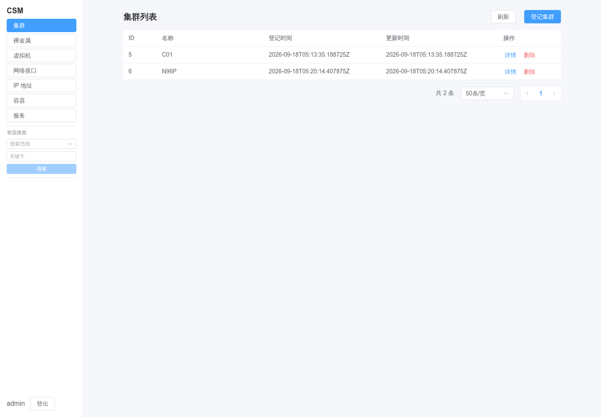
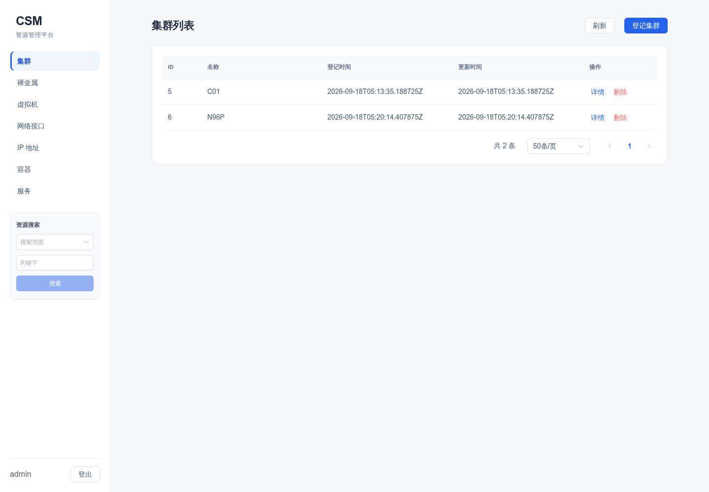
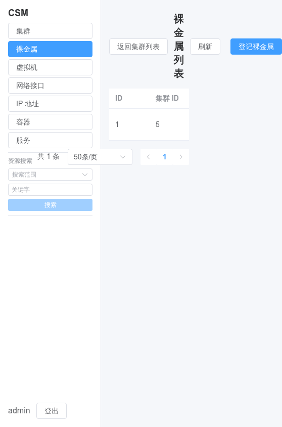
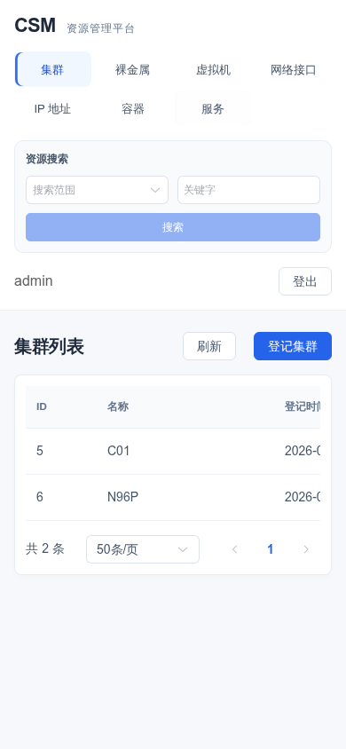
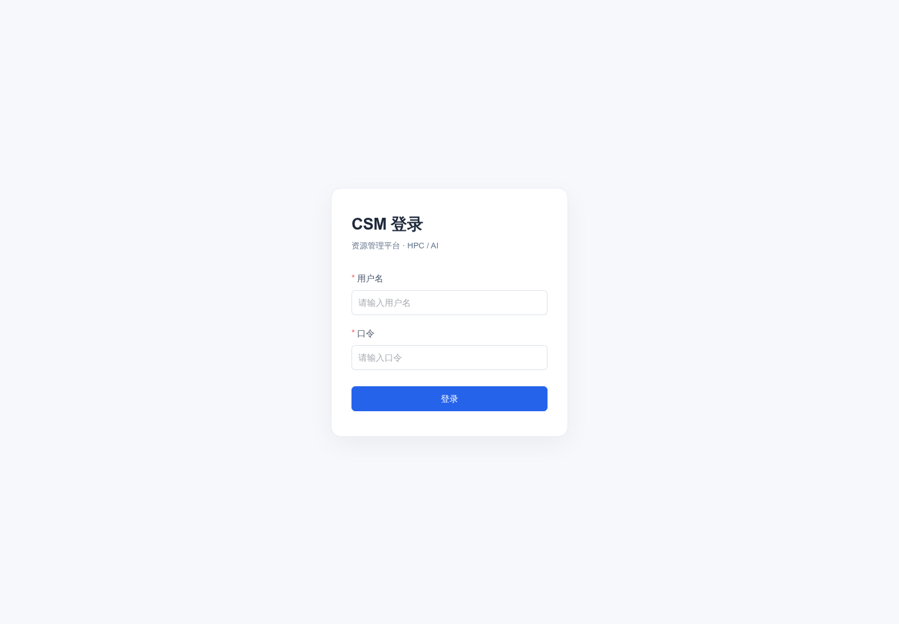

# 前端视觉优化与浏览器验证

## 范围

用户授权：检查页面是否简洁好看，不好看则修改，可使用真实浏览器。
本次为纯呈现维护，不新增产品能力，不改变 API、业务规则、时间格式、导航与校验。
分支：`fix/ui-visual-polish`，起点 `1a743db`。未部署、未推送，不修改原 Feature 完成状态。

## 实际观察与调整

使用 Playwright / Chromium 打开已部署页面，登录后只读浏览真实资源。
原页面桌面端侧栏边框密集、搜索控件偏小、列表与背景层次弱；390px 下标题竖排、操作按钮和分页溢出。

- `frontend/src/App.vue`：浅蓝选中态、无边框导航、统一间距、搜索分区；桌面侧栏可独立滚动，窄屏改为顶部网格导航。
- `frontend/src/assets/main.css`：统一蓝灰配色、内容卡片、表头与行间距、可换行分页、弹窗最大宽度；长关键字标签换行。
- `frontend/src/pages/LoginPage.vue`：调整品牌层次、输入高度和卡片留白。
- 没有改变任何 Vue script、API 调用或资源数据。品牌说明是本次仅有的模板文本增量。

### 截图（真实浏览器，不是设计稿）

| 桌面原版 | 桌面新版 |
| --- | --- |
|  |  |

| 手机原版（裸金属列表） | 手机新版（集群列表） |
| --- | --- |
|  |  |



新版运行于本地 Vite 预览，API 代理到已有实例。不是已部署新版的截图。
浏览器操作仅登录、读取列表/详情、搜索，打开登记弹窗后取消，没有登记、修改或删除资源。

## 验证

- `npm run typecheck`：通过。
- `npm run test`：最终版本连续两次均 **43 files / 642 passed**，未修改既有测试。
- `npm run build`：通过；已有大 chunk 提示仍存在。
- Chromium：**48 项布局检查通过**、没有 pageerror。
  - 1440 / 1024 / 768 / 760 / 390 / 320px × 7 种资源列表：42 项文档无横向溢出检查。
  - 390 / 320px × 登记弹窗、集群详情、搜索空态：6 项。
  - 宽表保留 Element Plus 内部水平滚动，不隐藏列。
- 协调器实际查看了桌面、登录、手机列表、详情、搜索空态截图；审美判断是主观评价，不等于完整可访问性认证。
- 持久化浏览器探针发现长关键字导致 390px 页面宽达 402px；加入标题/标签换行后，同一探针通过。早期临时探针的选择器误匹配遮罩、错误查找嵌套 input 均已纠正，不属于应用缺陷。

## 重跑真实浏览器探针

脚本：`frontend/scripts/check-visual-layout.cjs`。
需要已有 Playwright + Chromium 安装；没有新增应用依赖。
使用含至少一个可见集群的测试环境账户；脚本会创建登录会话，但不会写入资源。不要将口令写入仓库。

```bash
# 启动本地预览；请把代理地址换成目标测试 API。
cd frontend
CSM_DEV_API_TARGET=http://127.0.0.1 npm run dev -- --host 127.0.0.1 --port 5178
```

另一个终端（仓库根目录）：

```bash
export CSM_UI_URL=http://127.0.0.1:5178
export CSM_UI_USERNAME='<测试账户>'
read -rs -p 'Password: ' CSM_UI_PASSWORD; echo
export CSM_UI_PASSWORD
# 若 node 默认路径无法解析 playwright，指定已有安装绝对路径：
export CSM_PLAYWRIGHT_MODULE='/absolute/path/to/node_modules/playwright'
export CSM_UI_ARTIFACTS=/tmp/csm-ui-artifacts
node frontend/scripts/check-visual-layout.cjs
unset CSM_UI_PASSWORD
```

## Review 与限制

独立 reviewer 首轮只读代码复核、重跑 642 条测试：APPROVED，无阻塞问题。
其无法读取图片，视觉判断由协调器实际查看 Chromium 截图完成，不将其称作独立视觉验收。
首轮观察项中的移动端搜索按钮半宽、标题特异性、活跃导航 hover 已调整；随后增加长标签回归与 320px 详情/弹窗/搜索检查。
最终增量只读复核：APPROVED WITH FOLLOW-UP，无阻塞项。保留两项低优先级限制：全局样式依赖页面 DOM 结构，后续结构变化需要重跑探针；空态探针使用固定罕见字符串，若目标数据恰好包含该字符串会误失败。此为工作区代码复核，不是 Git Merge Gate 批准，未提交、未合并。

未验证：其他浏览器、所有资源类型的编辑弹窗、所有详情页和长数据组合、完整键盘/读屏与 WCAG 审计。
后端未改，不重新运行后端全量测试。未部署到生产，未声称线上外观已更新。
